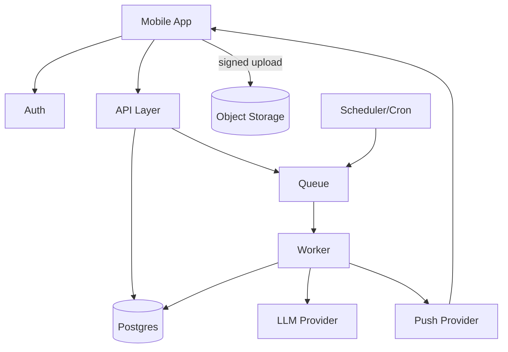

# Weave Backend Architecture

## Table of Contents

1. [Core Principles](#core-principles)
2. [Tech Stack](#tech-stack)
3. [Service Architecture](#service-architecture)
4. [Data Model](#data-model)
   - [Users & Identity](#users--identity)
   - [Goals & Planning](#goals--planning)
   - [Subtasks](#subtasks)
   - [Captures & Proof](#captures--proof)
   - [Journal & Triad](#journal--triad)
   - [Stats & Aggregates](#stats--aggregates)
   - [AI System](#ai-system)
   - [Events](#events)
5. [API Surface](#api-surface)
6. [Event-Driven Workflows](#event-driven-workflows)
7. [Security Model](#security-model)
8. [Performance & Indexing](#performance--indexing)
9. [MVP Scope](#mvp-scope)

---

# Core Principles

## Data Classification

Your backend has two kinds of data:

### Canonical Truth (Must Never Lie)

These are immutable event logs that represent what actually happened:

- Goals, Q-goals, subtasks
- Completions (immutable completion events)
- Captures (photos, notes, audio)
- Journals (daily reflections)
- Identity documents

**Key Point:** These should never be edited in a way that changes history. If a user "edits" a completion, create a new record or mark it as superseded.

### Derived Views (Can Be Recomputed)

These are computed from canonical truth and can be regenerated:

- Streaks (calculated from completions)
- Consistency percentages (calculated from daily aggregates)
- Ranks and badges (calculated from stats)
- Daily summaries (generated from journal + completions)
- AI insights (generated from patterns)

**Key Point:** If these get corrupted, you can always recompute them from canonical truth.

### Critical Rule

> **If you mix these up, you'll ship either a slow app or a dishonest one.**

- Storing streaks as canonical truth = dishonest (can be manipulated)
- Computing streaks on every request = slow (expensive queries)
- Solution: Pre-compute derived views, but always be able to regenerate them

---

# Tech Stack

## Option A: Supabase-First (Recommended for MVP)

**Rationale:** Fewer moving parts, Row Level Security built-in, easy storage, fast iteration.

### Components

| Component | Technology | Notes |
|-----------|-----------|-------|
| **Auth** | Supabase Auth | Built-in, handles OAuth, email/password |
| **Database** | Postgres (Supabase) | Managed, automatic backups |
| **Storage** | Supabase Storage | S3-compatible, easy file uploads |
| **API** | PostgREST + Edge Functions | Auto-generated REST API from schema |
| **Jobs** | External worker + queue | Recommended: Redis + BullMQ |
| **Push** | Expo Push | For mobile notifications |
| **Analytics** | PostHog | User behavior tracking |
| **Errors** | Sentry | Error monitoring and alerting |

### Advantages

- ✅ Row Level Security (RLS) built-in
- ✅ Auto-generated REST API from database schema
- ✅ Real-time subscriptions out of the box
- ✅ Integrated storage with signed URLs
- ✅ Fast development iteration

## Option B: Custom API (Best Long-Term Control)

**Rationale:** Total control, cleaner enterprise posture later.

### Components

| Component | Technology | Notes |
|-----------|-----------|-------|
| **Auth** | Clerk | Enterprise-ready auth |
| **API** | Next.js API routes or NestJS | Full control over endpoints |
| **Database** | Managed Postgres (Neon/RDS) | Direct database access |
| **Storage** | S3 | Standard object storage |
| **Queue** | Redis + BullMQ | Or Cloud Tasks (GCP) |
| **Worker** | Node/TypeScript | Custom job processing |

### Advantages

- ✅ Complete control over API design
- ✅ Better for enterprise requirements
- ✅ More flexible architecture
- ✅ Easier to customize for specific needs

## Recommendation

**Supabase Auth is the right MVP call** unless you have a strong reason to use Clerk (like you already have Clerk wiring, or you need very specific enterprise login features). 

Clerk is great, but it's "more backend" for no user-visible gain in V1.

---

# Service Architecture

## MVP Architecture: Single Backend + Worker

```
┌─────────────────────┐
│  Mobile App          │
│  (React Native)     │
└──────────┬──────────┘
           │
           ├─────────────────┐
           │                 │
           ▼                 ▼
    ┌─────────────┐   ┌──────────────┐
    │   Auth      │   │  API Layer   │
    │ (Supabase)  │   │              │
    └─────────────┘   └──────┬───────┘
                             │
                             ├─ If Supabase: Direct DB via RLS + Edge Functions
                             └─ If Custom: REST/tRPC monolith
                             │
                             ▼
                    ┌─────────────────┐
                    │    Postgres     │
                    │ (source of truth)│
                    └─────────────────┘
                             │
           ┌─────────────────┼─────────────────┐
           │                 │                 │
           ▼                 ▼                 ▼
    ┌─────────────┐  ┌──────────────┐  ┌─────────────┐
    │   Object    │  │    Queue     │  │   Worker    │
    │  Storage    │  │  (Redis)     │  │  (async)    │
    │ (proof media)│  └──────┬───────┘  └──────┬──────┘
    └─────────────┘          │                 │
                             │                 ├─ LLM Provider
                             │                 └─ Push Notifications
                             │
                             ▼
                    ┌─────────────────┐
                    │   Scheduler/    │
                    │   Cron Jobs      │
                    └─────────────────┘
```

### Mermaid Diagram



---

# Data Model

## Users & Identity

### UserProfile

Stores basic user information and preferences.

```sql
CREATE TABLE user_profiles (
  id UUID PRIMARY KEY DEFAULT gen_random_uuid(),
  auth_user_id TEXT UNIQUE NOT NULL,        -- Supabase auth user ID
  display_name TEXT,                        -- User's display name
  timezone TEXT NOT NULL,                   -- Critical for local_date calculations
  locale TEXT DEFAULT 'en-US',              -- User's locale preference
  created_at TIMESTAMPTZ DEFAULT NOW(),
  updated_at TIMESTAMPTZ DEFAULT NOW(),
  last_active_at TIMESTAMPTZ                -- Last time user was active
);

CREATE INDEX idx_user_profiles_auth_id ON user_profiles(auth_user_id);
```

**Key Fields:**
- `timezone` - Critical for converting UTC timestamps to user's local date
- `auth_user_id` - Links to Supabase auth system

### IdentityDoc

Stores user's identity profile that informs AI behavior. Versioned to allow rollback and reference specific versions.

```sql
CREATE TABLE identity_docs (
  id UUID PRIMARY KEY DEFAULT gen_random_uuid(),
  user_id UUID NOT NULL REFERENCES user_profiles(id) ON DELETE CASCADE,
  version INT NOT NULL,                     -- Version number for rollback capability
  json JSONB NOT NULL,                      -- Contains:
                                            --   - archetype (MBTI-like)
                                            --   - dream_self (description)
                                            --   - motivations (array)
                                            --   - constraints (time windows, energy patterns)
                                            --   - coaching_preference (gentle/strict)
                                            --   - failure_mode (procrastination, etc.)
  created_at TIMESTAMPTZ DEFAULT NOW(),
  UNIQUE(user_id, version)
);

CREATE INDEX idx_identity_docs_user_version ON identity_docs(user_id, version DESC);
```

**Why versioning:** So AI can reference "IdentityDoc v3" and you can roll back if needed.

---

## Goals & Planning

### Goal

Top-level user goals (max 3 active at a time).

```sql
CREATE TYPE goal_status AS ENUM ('active', 'paused', 'completed', 'archived');
CREATE TYPE goal_priority AS ENUM ('low', 'med', 'high');

CREATE TABLE goals (
  id UUID PRIMARY KEY DEFAULT gen_random_uuid(),
  user_id UUID NOT NULL REFERENCES user_profiles(id) ON DELETE CASCADE,
  title TEXT NOT NULL,                      -- Goal title (e.g., "Get jacked")
  description TEXT,                         -- Optional detailed description
  status goal_status DEFAULT 'active',      -- Current status
  priority goal_priority DEFAULT 'med',     -- Priority level
  start_date DATE,                          -- When goal started
  target_date DATE,                         -- Target completion date
  created_at TIMESTAMPTZ DEFAULT NOW(),
  updated_at TIMESTAMPTZ DEFAULT NOW()
);

CREATE INDEX idx_goals_user_status ON goals(user_id, status);
```

### QGoal (Quantifiable Goal)

Breakdown of goals into measurable sub-goals with cadence and metrics.

**Note:** You might not need "QGoal" as a separate thing if you're early. But you do want it if you're serious about "Goal → QGoal → Subtasks" staying clean.

```sql
CREATE TYPE cadence_type AS ENUM ('daily', 'weekly', '2x_week', 'custom');
CREATE TYPE metric_type AS ENUM ('count', 'minutes', 'binary', 'numeric');

CREATE TABLE qgoals (
  id UUID PRIMARY KEY DEFAULT gen_random_uuid(),
  goal_id UUID NOT NULL REFERENCES goals(id) ON DELETE CASCADE,
  title TEXT NOT NULL,                      -- Q-goal title
  cadence cadence_type NOT NULL,           -- How often (daily, weekly, etc.)
  metric_type metric_type NOT NULL,        -- Type of measurement
  unit TEXT,                                -- Unit of measurement (pages, workouts, minutes)
  baseline_value NUMERIC,                   -- Starting value
  target_value NUMERIC NOT NULL,            -- Target value
  start_date DATE NOT NULL,
  end_date DATE,                            -- Optional end date
  created_at TIMESTAMPTZ DEFAULT NOW()
);

CREATE INDEX idx_qgoals_goal_id ON qgoals(goal_id);
```

**Example:** Goal "Get fit" → QGoal "Lift weights 3x per week" (cadence: weekly, metric_type: count, target_value: 3)

---

## Subtasks

### SubtaskTemplate

Reusable task templates that can generate instances.

```sql
CREATE TYPE created_by_type AS ENUM ('user', 'ai');

CREATE TABLE subtask_templates (
  id UUID PRIMARY KEY DEFAULT gen_random_uuid(),
  user_id UUID NOT NULL REFERENCES user_profiles(id) ON DELETE CASCADE,
  goal_id UUID REFERENCES goals(id) ON DELETE SET NULL,
  qgoal_id UUID REFERENCES qgoals(id) ON DELETE SET NULL,
  title TEXT NOT NULL,                      -- Task title
  default_estimated_minutes INT NOT NULL,  -- Default time estimate
  difficulty INT CHECK (difficulty >= 1 AND difficulty <= 15), -- 1-15 scale
  recurrence_rule TEXT,                    -- RRULE format or custom
  is_archived BOOLEAN DEFAULT FALSE,
  created_by created_by_type DEFAULT 'user', -- Who created it
  created_at TIMESTAMPTZ DEFAULT NOW()
);

CREATE INDEX idx_subtask_templates_user_goal ON subtask_templates(user_id, goal_id);
```

### SubtaskInstance

Specific instance of a task scheduled for a particular date.

```sql
CREATE TYPE subtask_status AS ENUM ('planned', 'done', 'skipped', 'snoozed');

CREATE TABLE subtask_instances (
  id UUID PRIMARY KEY DEFAULT gen_random_uuid(),
  user_id UUID NOT NULL REFERENCES user_profiles(id) ON DELETE CASCADE,
  template_id UUID REFERENCES subtask_templates(id) ON DELETE SET NULL,
  goal_id UUID REFERENCES goals(id) ON DELETE SET NULL, -- Denormalized for faster queries
  qgoal_id UUID REFERENCES qgoals(id) ON DELETE SET NULL,
  scheduled_for_date DATE NOT NULL,        -- User's local date
  status subtask_status DEFAULT 'planned',
  completed_at TIMESTAMPTZ,                -- When actually completed
  estimated_minutes INT NOT NULL,          -- Time estimate for this instance
  actual_minutes INT,                      -- Actual time spent
  title_override TEXT,                     -- Override template title if needed
  notes TEXT,                               -- User notes
  sort_order INT DEFAULT 0,                 -- Display order
  created_at TIMESTAMPTZ DEFAULT NOW()
);

CREATE INDEX idx_subtask_instances_user_date ON subtask_instances(user_id, scheduled_for_date);
CREATE INDEX idx_subtask_instances_status ON subtask_instances(status);
```

### SubtaskCompletion

**Immutable event log** for task completions. This is canonical truth.

**Why separate completion table:** It's your immutable event log for "truth." SubtaskInstance status can be edited; completion events should not.

```sql
CREATE TABLE subtask_completions (
  id UUID PRIMARY KEY DEFAULT gen_random_uuid(),
  subtask_instance_id UUID NOT NULL REFERENCES subtask_instances(id) ON DELETE CASCADE,
  user_id UUID NOT NULL REFERENCES user_profiles(id) ON DELETE CASCADE,
  completed_at TIMESTAMPTZ NOT NULL,       -- When completed (UTC)
  local_date DATE NOT NULL,                 -- User's local date
  duration_minutes INT,                     -- Actual duration
  created_at TIMESTAMPTZ DEFAULT NOW()
);

CREATE INDEX idx_subtask_completions_user_date ON subtask_completions(user_id, local_date);
CREATE INDEX idx_subtask_completions_instance ON subtask_completions(subtask_instance_id);
```

**Key Point:** This table is append-only. Never update or delete rows here.

---

## Captures & Proof

### Capture

User-created content (photos, notes, audio, timers) that can serve as proof.

```sql
CREATE TYPE capture_type AS ENUM ('text', 'photo', 'audio', 'timer', 'link');

CREATE TABLE captures (
  id UUID PRIMARY KEY DEFAULT gen_random_uuid(),
  user_id UUID NOT NULL REFERENCES user_profiles(id) ON DELETE CASCADE,
  type capture_type NOT NULL,
  content_text TEXT,                        -- Text content or note
  storage_key TEXT,                         -- S3/Supabase storage key for media files
  transcript_text TEXT,                     -- Audio transcription (if type = 'audio')
  goal_id UUID REFERENCES goals(id) ON DELETE SET NULL,
  qgoal_id UUID REFERENCES qgoals(id) ON DELETE SET NULL,
  subtask_instance_id UUID REFERENCES subtask_instances(id) ON DELETE SET NULL,
  created_at TIMESTAMPTZ DEFAULT NOW(),
  local_date DATE NOT NULL                 -- User's local date
);

CREATE INDEX idx_captures_user_date ON captures(user_id, local_date);
CREATE INDEX idx_captures_type ON captures(type);
```

### SubtaskProof

Join table linking captures to subtask instances as proof.

**Purpose:** This lets you do "trust-based proof" cleanly without pretending to verify anything.

```sql
CREATE TABLE subtask_proofs (
  subtask_instance_id UUID NOT NULL REFERENCES subtask_instances(id) ON DELETE CASCADE,
  capture_id UUID NOT NULL REFERENCES captures(id) ON DELETE CASCADE,
  created_at TIMESTAMPTZ DEFAULT NOW(),
  PRIMARY KEY (subtask_instance_id, capture_id)
);
```

**Usage:** When user completes a task and uploads a photo, create a capture and link it via this table.

---

## Journal & Triad

### JournalEntry

Daily reflection and fulfillment tracking. One per user per day.

```sql
CREATE TABLE journal_entries (
  id UUID PRIMARY KEY DEFAULT gen_random_uuid(),
  user_id UUID NOT NULL REFERENCES user_profiles(id) ON DELETE CASCADE,
  local_date DATE NOT NULL,                 -- User's local date (unique per user)
  fulfillment_score INT CHECK (fulfillment_score >= 1 AND fulfillment_score <= 10),
  text TEXT NOT NULL,                       -- Journal entry text
  created_at TIMESTAMPTZ DEFAULT NOW(),
  UNIQUE(user_id, local_date)
);

CREATE INDEX idx_journal_entries_user_date ON journal_entries(user_id, local_date);
```

### TriadTask

AI-generated "triad" of 3 tasks for tomorrow. Generated after journal submission.

```sql
CREATE TABLE triad_tasks (
  id UUID PRIMARY KEY DEFAULT gen_random_uuid(),
  user_id UUID NOT NULL REFERENCES user_profiles(id) ON DELETE CASCADE,
  date_for DATE NOT NULL,                   -- Tomorrow in user's timezone
  rank INT NOT NULL CHECK (rank >= 1 AND rank <= 3), -- 1, 2, or 3
  title TEXT NOT NULL,                      -- Task title
  linked_subtask_instance_id UUID REFERENCES subtask_instances(id) ON DELETE SET NULL,
  generated_by_run_id UUID,                 -- References ai_runs(id) for traceability
  created_at TIMESTAMPTZ DEFAULT NOW(),
  UNIQUE(user_id, date_for, rank)
);

CREATE INDEX idx_triad_tasks_user_date ON triad_tasks(user_id, date_for);
```

**Purpose:** After user submits journal, AI generates 3 tasks for tomorrow (one easy, one medium, one important).

---

## Stats & Aggregates

### DailyAggregate

**Pre-computed daily stats** for fast dashboard queries. Updated by worker.

**Purpose:** Pre-computed daily stats for fast dashboard queries.

```sql
CREATE TABLE daily_aggregates (
  user_id UUID NOT NULL REFERENCES user_profiles(id) ON DELETE CASCADE,
  local_date DATE NOT NULL,
  completed_count INT DEFAULT 0,            -- Number of subtasks completed
  has_journal BOOLEAN DEFAULT FALSE,       -- Journal entry exists
  has_proof BOOLEAN DEFAULT FALSE,         -- At least one capture exists
  active_day_with_proof BOOLEAN DEFAULT FALSE, -- Active day metric (1 subtask + journal/capture)
  updated_at TIMESTAMPTZ DEFAULT NOW(),
  PRIMARY KEY (user_id, local_date)
);
```

**Computation:** Worker recomputes this whenever:
- Subtask is completed
- Journal is submitted
- Capture is created

### UserStats

User-level aggregated stats, computed by worker nightly.

**Purpose:** User-level aggregated stats, computed by worker.

```sql
CREATE TABLE user_stats (
  user_id UUID PRIMARY KEY REFERENCES user_profiles(id) ON DELETE CASCADE,
  current_streak INT DEFAULT 0,            -- Current active day streak
  longest_streak INT DEFAULT 0,            -- Longest streak ever
  consistency_30d NUMERIC DEFAULT 0,       -- Consistency % over last 30 days
  rank_level INT DEFAULT 0,                -- User's rank/level
  updated_at TIMESTAMPTZ DEFAULT NOW()
);
```

**Computation:** Worker updates this nightly per timezone.

### Badges

Global badge definitions and user badge assignments.

```sql
CREATE TABLE badges (
  badge_id UUID PRIMARY KEY DEFAULT gen_random_uuid(),
  name TEXT NOT NULL UNIQUE,               -- Badge name (e.g., "Consistency Master")
  criteria_json JSONB NOT NULL             -- Criteria for earning (e.g., {"consistency_30d": 0.8})
);

CREATE TABLE user_badges (
  user_id UUID NOT NULL REFERENCES user_profiles(id) ON DELETE CASCADE,
  badge_id UUID NOT NULL REFERENCES badges(badge_id) ON DELETE CASCADE,
  earned_at TIMESTAMPTZ DEFAULT NOW(),
  PRIMARY KEY (user_id, badge_id)
);

CREATE INDEX idx_user_badges_user ON user_badges(user_id);
```

**Rule:** Compute these in the worker, not in the app.

---

## AI System

**Purpose:** If AI outputs are editable, you need persistent artifacts and run tracking.

### AiRun

Tracks each AI generation run for debugging, caching, and cost tracking.

```sql
CREATE TYPE ai_module AS ENUM ('onboarding', 'triad', 'recap', 'dream_self', 'weekly_insights');
CREATE TYPE ai_run_status AS ENUM ('queued', 'running', 'success', 'failed');

CREATE TABLE ai_runs (
  id UUID PRIMARY KEY DEFAULT gen_random_uuid(),
  user_id UUID NOT NULL REFERENCES user_profiles(id) ON DELETE CASCADE,
  module ai_module NOT NULL,               -- Which AI module
  input_hash TEXT NOT NULL,                -- Hash of inputs for dedupe + caching
  prompt_version TEXT NOT NULL,            -- Version of prompt used
  model TEXT NOT NULL,                     -- Model used (e.g., "gpt-4", "claude-3")
  params_json JSONB,                       -- Model parameters (temperature, etc.)
  status ai_run_status DEFAULT 'queued',
  cost_estimate NUMERIC,                   -- Estimated cost in USD
  created_at TIMESTAMPTZ DEFAULT NOW()
);

CREATE INDEX idx_ai_runs_user_module ON ai_runs(user_id, module);
CREATE INDEX idx_ai_runs_input_hash ON ai_runs(input_hash);
```

### AiArtifact

The actual AI-generated content. Can be edited by users.

```sql
CREATE TYPE artifact_type AS ENUM ('goal_tree', 'triad', 'recap', 'insight', 'message');

CREATE TABLE ai_artifacts (
  id UUID PRIMARY KEY DEFAULT gen_random_uuid(),
  run_id UUID NOT NULL REFERENCES ai_runs(id) ON DELETE CASCADE,
  user_id UUID NOT NULL REFERENCES user_profiles(id) ON DELETE CASCADE,
  type artifact_type NOT NULL,
  json JSONB NOT NULL,                     -- Schema-validated AI output
  is_user_edited BOOLEAN DEFAULT FALSE,     -- Has user edited this?
  supersedes_id UUID REFERENCES ai_artifacts(id) ON DELETE SET NULL, -- If regenerated
  created_at TIMESTAMPTZ DEFAULT NOW()
);

CREATE INDEX idx_ai_artifacts_user_type ON ai_artifacts(user_id, type);
CREATE INDEX idx_ai_artifacts_run ON ai_artifacts(run_id);
```

### UserEdit

Tracks user edits to AI artifacts for audit trail.

```sql
CREATE TABLE user_edits (
  id UUID PRIMARY KEY DEFAULT gen_random_uuid(),
  user_id UUID NOT NULL REFERENCES user_profiles(id) ON DELETE CASCADE,
  artifact_id UUID NOT NULL REFERENCES ai_artifacts(id) ON DELETE CASCADE,
  patch_json JSONB NOT NULL,               -- JSONPatch format
  created_at TIMESTAMPTZ DEFAULT NOW()
);

CREATE INDEX idx_user_edits_artifact ON user_edits(artifact_id);
```

**Why this matters:** This is what makes determinism, caching, debugging, and editability actually work.

---

## Events

### EventLog

**Append-only event log** for event-driven workflows.

**Purpose:** Append-only event log for event-driven workflows.

```sql
CREATE TYPE event_type AS ENUM (
  'journal_submitted',
  'subtask_completed',
  'capture_created',
  'identity_updated',
  'goal_updated'
);

CREATE TABLE event_log (
  id UUID PRIMARY KEY DEFAULT gen_random_uuid(),
  user_id UUID NOT NULL REFERENCES user_profiles(id) ON DELETE CASCADE,
  type event_type NOT NULL,
  entity_id UUID NOT NULL,                  -- ID of the entity that triggered event
  created_at TIMESTAMPTZ DEFAULT NOW(),
  local_date DATE NOT NULL                  -- User's local date
);

CREATE INDEX idx_event_log_user_date ON event_log(user_id, local_date);
CREATE INDEX idx_event_log_type ON event_log(type);
CREATE INDEX idx_event_log_created ON event_log(created_at);
```

**Usage:** Worker processes events from this table to trigger async jobs.

---

# API Surface

**Design Principles:** Few endpoints, predictable, and idempotent.

## Core Endpoints

### Journal

```http
POST /journal
Content-Type: application/json

{
  "local_date": "2024-01-15",
  "fulfillment_score": 7,
  "text": "Today was productive..."
}

Response: 200 OK
{
  "id": "uuid",
  "local_date": "2024-01-15",
  ...
}
```

```http
GET /journal?date=2024-01-15

Response: 200 OK
{
  "id": "uuid",
  "local_date": "2024-01-15",
  "fulfillment_score": 7,
  "text": "...",
  ...
}
```

### Dashboard

```http
GET /dashboard?date=2024-01-15

Response: 200 OK
{
  "daily_aggregate": {
    "completed_count": 3,
    "has_journal": true,
    "has_proof": true,
    "active_day_with_proof": true
  },
  "triad": [
    { "rank": 1, "title": "Easy task", ... },
    { "rank": 2, "title": "Medium task", ... },
    { "rank": 3, "title": "Important task", ... }
  ],
  "active_goals": [...],
  "streak": 5,
  "badges": [...]
}
```

### Goals

```http
POST /goals
Content-Type: application/json

{
  "title": "Get jacked",
  "description": "Build muscle and strength",
  "priority": "high"
}

PATCH /goals/:id
Content-Type: application/json

{
  "status": "paused"
}

GET /goals

Response: 200 OK
{
  "goals": [
    { "id": "...", "title": "...", ... }
  ]
}
```

### QGoals

```http
POST /qgoals
Content-Type: application/json

{
  "goal_id": "uuid",
  "title": "Lift weights 3x per week",
  "cadence": "weekly",
  "metric_type": "count",
  "target_value": 3
}

PATCH /qgoals/:id
GET /qgoals?goal_id=uuid
```

### Subtasks

```http
POST /subtask-templates
Content-Type: application/json

{
  "goal_id": "uuid",
  "title": "Bench press workout",
  "default_estimated_minutes": 60,
  "difficulty": 5
}

POST /subtask-instances
Content-Type: application/json

{
  "template_id": "uuid",
  "scheduled_for_date": "2024-01-16",
  "estimated_minutes": 60
}

POST /subtask-completions
Content-Type: application/json

{
  "subtask_instance_id": "uuid",
  "idempotency_key": "unique-key-123",
  "duration_minutes": 65
}

GET /subtask-instances?date=2024-01-16
```

### Captures

```http
POST /captures
Content-Type: application/json

{
  "type": "photo",
  "subtask_instance_id": "uuid"
}

Response: 200 OK
{
  "id": "uuid",
  "signed_upload_url": "https://...",
  "expires_at": "2024-01-15T12:00:00Z"
}

POST /captures/:id/attach-proof
Content-Type: application/json

{
  "subtask_instance_id": "uuid"
}

GET /captures?date=2024-01-15
```

### AI

```http
POST /ai/regenerate-triad
Content-Type: application/json

{
  "date_for": "2024-01-16"
}

Response: 202 Accepted
{
  "run_id": "uuid",
  "status": "queued"
}
```

**Note:** Rate-limited to prevent abuse.

### Devices

```http
POST /devices/register-push-token
Content-Type: application/json

{
  "token": "expo-push-token-...",
  "device_id": "unique-device-id"
}
```

## Implementation Notes

**If using Supabase directly:**
- Many of these are just table operations with RLS
- Use Edge Functions for "do two writes atomically" flows (e.g., complete subtask + create completion event)
- PostgREST auto-generates REST API from schema

**If using custom API:**
- Implement all endpoints manually
- Use middleware for auth, validation, rate limiting
- Ensure idempotency for completion endpoints

---

# Event-Driven Workflows

## Event Handlers

### On `journal_submitted`

When user submits their daily journal:

1. **Recompute `DailyAggregate`** for that date
   - Check if `active_day_with_proof` = true
   - Update `has_journal` = true

2. **Generate triad for tomorrow** (if not already generated)
   - Call AI module `triad` with user's goals, history, fulfillment trend
   - Create 3 `triad_tasks` for tomorrow
   - Link to `subtask_instances` if applicable

3. **Generate daily recap**
   - Call AI module `recap` with journal + completions + captures
   - Create `ai_artifact` of type `recap`

4. **Schedule next day push notifications**
   - Queue notification job for tomorrow morning
   - Include triad tasks and daily intention

### On `subtask_completed`

When user completes a subtask:

1. **Recompute `DailyAggregate`**
   - Increment `completed_count`
   - Check if `active_day_with_proof` should be true

2. **Recompute streak and rank** (or mark dirty for nightly)
   - If real-time: Update `user_stats.current_streak`
   - If batched: Mark user for nightly recomputation

### On `capture_created`

When user creates a capture (photo, note, audio):

1. **Recompute `DailyAggregate`**
   - Set `has_proof` = true
   - Check if `active_day_with_proof` should be true

2. **If audio, enqueue transcription**
   - Queue transcription job
   - Update `capture.transcript_text` when complete

3. **Optionally attach "proof" suggestions**
   - AI suggests linking capture to recent subtask instances
   - User can accept or ignore

## Scheduled Jobs

### Nightly Cron (Per Timezone)

Runs at midnight in each user's timezone:

1. **Finalize day summary**
   - Ensure `DailyAggregate` is up to date for yesterday
   - Mark any incomplete aggregates

2. **Compute rolling `consistency_7d` and `consistency_30d`**
   - Calculate from `DailyAggregate` table
   - Update `user_stats.consistency_30d`

3. **Badge evaluation**
   - Check all badge criteria against user stats
   - Award new badges if criteria met
   - Create `user_badges` records

### Weekly Cron

Runs once per week per user:

1. **Generate weekly insights**
   - Call AI module `weekly_insights`
   - Analyze patterns from past week
   - Create `ai_artifact` of type `insight`

2. **One check-in notification**
   - Send weekly summary notification
   - Highlight progress and achievements

---

# Security Model

## With Supabase

### Row Level Security (RLS)

Use RLS on every user-owned table:

```sql
-- Example: user_profiles table
ALTER TABLE user_profiles ENABLE ROW LEVEL SECURITY;

CREATE POLICY "Users can view own profile"
  ON user_profiles
  FOR SELECT
  USING (auth.uid()::text = auth_user_id);

CREATE POLICY "Users can update own profile"
  ON user_profiles
  FOR UPDATE
  USING (auth.uid()::text = auth_user_id);
```

**Policy pattern:** `auth.uid() = user_id` (or `auth_user_id`)

**For global tables (like badges):**
```sql
CREATE POLICY "Anyone can read badges"
  ON badges
  FOR SELECT
  USING (true);
```

**For joins (SubtaskProof):**
- Enforce ownership through joins
- Or store `user_id` redundantly for RLS

## With Custom API

### JWT Verification

```typescript
// Middleware example
function authenticate(req, res, next) {
  const token = req.headers.authorization?.split(' ')[1];
  const decoded = verifyJWT(token); // Clerk or Supabase JWT
  req.userId = decoded.sub;
  next();
}

// Every query filtered by user_id
function getGoals(userId) {
  return db.query('SELECT * FROM goals WHERE user_id = $1', [userId]);
}
```

**Best Practices:**
- JWT verification middleware on all routes
- Every query filtered by `user_id` server-side
- Use database constraints anyway (assume your API will have bugs)
- Never trust client-provided user IDs

## Additional Security

### Rate Limiting

- **AI endpoints:** 10 requests per hour per user
- **Upload endpoints:** 50 uploads per day per user
- **Completion endpoints:** 100 completions per day per user

### Input Validation

- Validate all inputs with Zod or similar
- Sanitize text inputs
- Validate file types and sizes for uploads
- Check date ranges and enums

### Upload Limits

- Max file size: 10MB per upload
- Allowed types: image/jpeg, image/png, audio/mpeg
- Virus scanning for uploaded files (optional but recommended)

---

# Performance & Indexing

## Critical Indexes

```sql
-- User lookups
CREATE INDEX idx_user_profiles_auth_id ON user_profiles(auth_user_id);

-- Subtask queries (most common)
CREATE INDEX idx_subtask_instances_user_date ON subtask_instances(user_id, scheduled_for_date);
CREATE INDEX idx_subtask_instances_status ON subtask_instances(status);
CREATE INDEX idx_subtask_completions_user_date ON subtask_completions(user_id, local_date);

-- Capture queries
CREATE INDEX idx_captures_user_date ON captures(user_id, local_date);
CREATE INDEX idx_captures_type ON captures(type);

-- Journal queries
CREATE INDEX idx_journal_entries_user_date ON journal_entries(user_id, local_date);

-- Goal queries
CREATE INDEX idx_goals_user_status ON goals(user_id, status);
CREATE INDEX idx_qgoals_goal_id ON qgoals(goal_id);

-- Triad queries
CREATE INDEX idx_triad_tasks_user_date ON triad_tasks(user_id, date_for);

-- Event log queries
CREATE INDEX idx_event_log_user_date ON event_log(user_id, local_date);
CREATE INDEX idx_event_log_type ON event_log(type);
CREATE INDEX idx_event_log_created ON event_log(created_at);

-- AI queries
CREATE INDEX idx_ai_runs_user_module ON ai_runs(user_id, module);
CREATE INDEX idx_ai_runs_input_hash ON ai_runs(input_hash);
CREATE INDEX idx_ai_artifacts_user_type ON ai_artifacts(user_id, type);
```

## Design Rule

**Dashboard should read mostly from:**
- `daily_aggregates` (pre-computed, fast)
- `triad_tasks` for date (small, indexed)
- Active goals (small, filtered by status)

**Not from scanning completions every time.**

**Example query:**
```sql
-- Fast: Uses daily_aggregates
SELECT * FROM daily_aggregates 
WHERE user_id = $1 AND local_date = $2;

-- Slow: Scans all completions
SELECT COUNT(*) FROM subtask_completions 
WHERE user_id = $1 AND local_date = $2;
```

---

# MVP Scope

## Must Ship

### Core Features
- ✅ Goals/Q-goals/Subtasks (CRUD operations)
- ✅ Completions + Captures + Journal (create and read)
- ✅ Daily aggregates + Streak (computed by worker)
- ✅ Triad + Recap generated around journal time
- ✅ Notifications basic (push notifications for reminders)

### Technical Requirements
- ✅ Database schema with all tables
- ✅ Basic API endpoints (or Supabase RLS)
- ✅ Worker for async jobs
- ✅ Event-driven architecture
- ✅ Authentication and authorization

## Add Later (Do Not Block MVP)

### Advanced Features
- Vector embeddings for second brain
- Multi-modal long-term memory
- Complex recurrence UI
- iMessage integration (harder than it sounds)

### Performance Optimizations
- Query result caching
- CDN for static assets
- Database connection pooling
- Read replicas for scaling

---

*Last Updated: Backend Architecture Planning*
