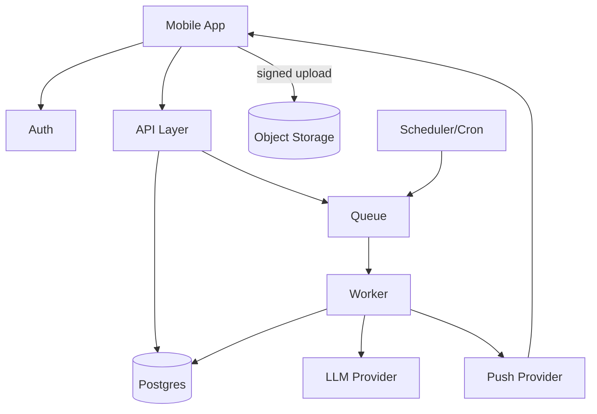

# Weave Backend Architecture

## Table of Contents

1. [Core Principles](#core-principles)
2. [Tech Stack](#tech-stack)
3. [Service Architecture](#service-architecture)
4. [Data Model](#data-model)
   - [Users & Identity](#users--identity)
   - [Goals & Planning](#goals--planning)
   - [Subtasks](#subtasks)
   - [Captures & Proof](#captures--proof)
   - [Journal & Triad](#journal--triad)
   - [Stats & Aggregates](#stats--aggregates)
   - [AI System](#ai-system)
   - [Events](#events)
5. [API Surface](#api-surface)
6. [Event-Driven Workflows](#event-driven-workflows)
7. [Security Model](#security-model)
8. [Performance & Indexing](#performance--indexing)
9. [MVP Scope](#mvp-scope)

---

# Core Principles

## Data Classification

Your backend has two kinds of data:

**Canonical Truth (Must Never Lie):**
- Goals, Q-goals, subtasks, completions, captures, journals, identity doc
- These are immutable event logs that represent what actually happened

**Derived Views (Can Be Recomputed):**
- Streaks, consistency %, ranks, badges, daily summaries, AI insights
- These are computed from canonical truth and can be regenerated

**Critical Rule:** If you mix these up, you'll ship either a slow app or a dishonest one.

---

# Tech Stack

## Option A: Supabase-First (Recommended for MVP)

**Rationale:** Fewer moving parts, Row Level Security built-in, easy storage, fast iteration.

- **Auth:** Supabase Auth
- **DB:** Postgres (Supabase)
- **Storage:** Supabase Storage (S3-compatible)
- **API:** PostgREST + Edge Functions (only where needed)
- **Jobs:** External worker + queue (recommended), or Supabase cron + edge functions (ok early)
- **Push:** Expo push
- **Analytics:** PostHog
- **Errors:** Sentry

## Option B: Custom API (Best Long-Term Control)

**Rationale:** Total control, cleaner enterprise posture later.

- **Auth:** Clerk
- **API:** Next.js API routes or NestJS
- **DB:** Managed Postgres (Neon/RDS)
- **Storage:** S3
- **Queue:** Redis + BullMQ (or Cloud Tasks)
- **Worker:** Node/TS

**Recommendation:** Supabase Auth is the right MVP call unless you have a strong reason to use Clerk (like you already have Clerk wiring, or you need very specific enterprise login features). Clerk is great, but it's "more backend" for no user-visible gain in V1.

---

# Service Architecture

## MVP Architecture: Single Backend + Worker

```
Mobile App (React Native)
    ↓
API Layer
    ├─ If Supabase: mostly direct DB via RLS + a few Edge Functions
    └─ If custom API: REST/tRPC in a monolith
    ↓
Postgres (source of truth)
    ↓
Object Storage (proof media, voice)
    ↓
Queue (Redis or managed queue)
    ↓
Worker (async jobs)
    ├─ LLM Provider (called only by worker, not by screens)
    └─ Push Notifications
```

### Mermaid Diagram



---

# Data Model

## Users & Identity

### UserProfile

```sql
CREATE TABLE user_profiles (
  id UUID PRIMARY KEY DEFAULT gen_random_uuid(),
  auth_user_id TEXT UNIQUE NOT NULL,
  display_name TEXT,
  timezone TEXT NOT NULL, -- Critical for local_date calculations
  locale TEXT DEFAULT 'en-US',
  created_at TIMESTAMPTZ DEFAULT NOW(),
  updated_at TIMESTAMPTZ DEFAULT NOW(),
  last_active_at TIMESTAMPTZ
);
```

### IdentityDoc

**Why versioning:** So AI can reference "IdentityDoc v3" and you can roll back.

```sql
CREATE TABLE identity_docs (
  id UUID PRIMARY KEY DEFAULT gen_random_uuid(),
  user_id UUID NOT NULL REFERENCES user_profiles(id),
  version INT NOT NULL,
  json JSONB NOT NULL, -- voice profile, motivations, constraints, "dream self" spec
  created_at TIMESTAMPTZ DEFAULT NOW(),
  UNIQUE(user_id, version)
);
```

---

## Goals & Planning

### Goal

```sql
CREATE TYPE goal_status AS ENUM ('active', 'paused', 'completed', 'archived');
CREATE TYPE goal_priority AS ENUM ('low', 'med', 'high');

CREATE TABLE goals (
  id UUID PRIMARY KEY DEFAULT gen_random_uuid(),
  user_id UUID NOT NULL REFERENCES user_profiles(id),
  title TEXT NOT NULL,
  description TEXT,
  status goal_status DEFAULT 'active',
  priority goal_priority DEFAULT 'med',
  start_date DATE,
  target_date DATE,
  created_at TIMESTAMPTZ DEFAULT NOW(),
  updated_at TIMESTAMPTZ DEFAULT NOW()
);
```

### QGoal (Quarter Goal)

**Note:** You might not need "QGoal" as a separate thing if you're early. But you do want it if you're serious about "Goal → QGoal → Subtasks" staying clean.

```sql
CREATE TYPE cadence_type AS ENUM ('daily', 'weekly', '2x_week', 'custom');
CREATE TYPE metric_type AS ENUM ('count', 'minutes', 'binary', 'numeric');

CREATE TABLE qgoals (
  id UUID PRIMARY KEY DEFAULT gen_random_uuid(),
  goal_id UUID NOT NULL REFERENCES goals(id),
  title TEXT NOT NULL,
  cadence cadence_type NOT NULL,
  metric_type metric_type NOT NULL,
  unit TEXT, -- pages, workouts, minutes
  baseline_value NUMERIC,
  target_value NUMERIC NOT NULL,
  start_date DATE NOT NULL,
  end_date DATE,
  created_at TIMESTAMPTZ DEFAULT NOW()
);
```

---

## Subtasks

### SubtaskTemplate

```sql
CREATE TYPE created_by_type AS ENUM ('user', 'ai');

CREATE TABLE subtask_templates (
  id UUID PRIMARY KEY DEFAULT gen_random_uuid(),
  user_id UUID NOT NULL REFERENCES user_profiles(id),
  goal_id UUID REFERENCES goals(id),
  qgoal_id UUID REFERENCES qgoals(id),
  title TEXT NOT NULL,
  default_estimated_minutes INT NOT NULL,
  difficulty INT CHECK (difficulty >= 1 AND difficulty <= 15),
  recurrence_rule TEXT, -- RRULE or your own format
  is_archived BOOLEAN DEFAULT FALSE,
  created_by created_by_type DEFAULT 'user',
  created_at TIMESTAMPTZ DEFAULT NOW()
);
```

### SubtaskInstance

```sql
CREATE TYPE subtask_status AS ENUM ('planned', 'done', 'skipped', 'snoozed');

CREATE TABLE subtask_instances (
  id UUID PRIMARY KEY DEFAULT gen_random_uuid(),
  user_id UUID NOT NULL REFERENCES user_profiles(id),
  template_id UUID REFERENCES subtask_templates(id),
  goal_id UUID REFERENCES goals(id), -- Denormalized for faster queries
  qgoal_id UUID REFERENCES qgoals(id),
  scheduled_for_date DATE NOT NULL, -- User local date
  status subtask_status DEFAULT 'planned',
  completed_at TIMESTAMPTZ,
  estimated_minutes INT NOT NULL,
  actual_minutes INT,
  title_override TEXT,
  notes TEXT,
  sort_order INT DEFAULT 0,
  created_at TIMESTAMPTZ DEFAULT NOW()
);
```

### SubtaskCompletion

**Why separate completion table:** It's your immutable event log for "truth." SubtaskInstance status can be edited; completion events should not.

```sql
CREATE TABLE subtask_completions (
  id UUID PRIMARY KEY DEFAULT gen_random_uuid(),
  subtask_instance_id UUID NOT NULL REFERENCES subtask_instances(id),
  user_id UUID NOT NULL REFERENCES user_profiles(id),
  completed_at TIMESTAMPTZ NOT NULL,
  local_date DATE NOT NULL,
  duration_minutes INT,
  created_at TIMESTAMPTZ DEFAULT NOW()
);
```

---

## Captures & Proof

### Capture

```sql
CREATE TYPE capture_type AS ENUM ('text', 'photo', 'audio', 'timer', 'link');

CREATE TABLE captures (
  id UUID PRIMARY KEY DEFAULT gen_random_uuid(),
  user_id UUID NOT NULL REFERENCES user_profiles(id),
  type capture_type NOT NULL,
  content_text TEXT,
  storage_key TEXT, -- For photo/audio
  transcript_text TEXT, -- Audio -> STT
  goal_id UUID REFERENCES goals(id),
  qgoal_id UUID REFERENCES qgoals(id),
  subtask_instance_id UUID REFERENCES subtask_instances(id),
  created_at TIMESTAMPTZ DEFAULT NOW(),
  local_date DATE NOT NULL
);
```

### SubtaskProof

**Purpose:** This lets you do "trust-based proof" cleanly without pretending to verify anything.

```sql
CREATE TABLE subtask_proofs (
  subtask_instance_id UUID NOT NULL REFERENCES subtask_instances(id),
  capture_id UUID NOT NULL REFERENCES captures(id),
  created_at TIMESTAMPTZ DEFAULT NOW(),
  PRIMARY KEY (subtask_instance_id, capture_id)
);
```

---

## Journal & Triad

### JournalEntry

```sql
CREATE TABLE journal_entries (
  id UUID PRIMARY KEY DEFAULT gen_random_uuid(),
  user_id UUID NOT NULL REFERENCES user_profiles(id),
  local_date DATE NOT NULL,
  fulfillment_score INT CHECK (fulfillment_score >= 1 AND fulfillment_score <= 10),
  text TEXT NOT NULL,
  created_at TIMESTAMPTZ DEFAULT NOW(),
  UNIQUE(user_id, local_date)
);
```

### TriadTask

```sql
CREATE TABLE triad_tasks (
  id UUID PRIMARY KEY DEFAULT gen_random_uuid(),
  user_id UUID NOT NULL REFERENCES user_profiles(id),
  date_for DATE NOT NULL, -- Tomorrow in user tz
  rank INT NOT NULL CHECK (rank >= 1 AND rank <= 3),
  title TEXT NOT NULL,
  linked_subtask_instance_id UUID REFERENCES subtask_instances(id),
  generated_by_run_id UUID, -- References ai_runs(id)
  created_at TIMESTAMPTZ DEFAULT NOW(),
  UNIQUE(user_id, date_for, rank)
);
```

---

## Stats & Aggregates

### DailyAggregate

**Purpose:** Pre-computed daily stats for fast dashboard queries.

```sql
CREATE TABLE daily_aggregates (
  user_id UUID NOT NULL REFERENCES user_profiles(id),
  local_date DATE NOT NULL,
  completed_count INT DEFAULT 0,
  has_journal BOOLEAN DEFAULT FALSE,
  has_proof BOOLEAN DEFAULT FALSE,
  active_day_with_proof BOOLEAN DEFAULT FALSE,
  updated_at TIMESTAMPTZ DEFAULT NOW(),
  PRIMARY KEY (user_id, local_date)
);
```

### UserStats

**Purpose:** User-level aggregated stats, computed by worker.

```sql
CREATE TABLE user_stats (
  user_id UUID PRIMARY KEY REFERENCES user_profiles(id),
  current_streak INT DEFAULT 0,
  longest_streak INT DEFAULT 0,
  consistency_30d NUMERIC DEFAULT 0,
  rank_level INT DEFAULT 0,
  updated_at TIMESTAMPTZ DEFAULT NOW()
);
```

### Badges

```sql
CREATE TABLE badges (
  badge_id UUID PRIMARY KEY DEFAULT gen_random_uuid(),
  name TEXT NOT NULL UNIQUE,
  criteria_json JSONB NOT NULL
);

CREATE TABLE user_badges (
  user_id UUID NOT NULL REFERENCES user_profiles(id),
  badge_id UUID NOT NULL REFERENCES badges(badge_id),
  earned_at TIMESTAMPTZ DEFAULT NOW(),
  PRIMARY KEY (user_id, badge_id)
);
```

**Rule:** Compute these in the worker, not in the app.

---

## AI System

**Purpose:** If AI outputs are editable, you need persistent artifacts and run tracking.

### AiRun

```sql
CREATE TYPE ai_module AS ENUM ('onboarding', 'triad', 'recap', 'dream_self', 'weekly_insights');
CREATE TYPE ai_run_status AS ENUM ('queued', 'running', 'success', 'failed');

CREATE TABLE ai_runs (
  id UUID PRIMARY KEY DEFAULT gen_random_uuid(),
  user_id UUID NOT NULL REFERENCES user_profiles(id),
  module ai_module NOT NULL,
  input_hash TEXT NOT NULL, -- For dedupe + caching
  prompt_version TEXT NOT NULL,
  model TEXT NOT NULL,
  params_json JSONB,
  status ai_run_status DEFAULT 'queued',
  cost_estimate NUMERIC,
  created_at TIMESTAMPTZ DEFAULT NOW()
);
```

### AiArtifact

```sql
CREATE TYPE artifact_type AS ENUM ('goal_tree', 'triad', 'recap', 'insight', 'message');

CREATE TABLE ai_artifacts (
  id UUID PRIMARY KEY DEFAULT gen_random_uuid(),
  run_id UUID NOT NULL REFERENCES ai_runs(id),
  user_id UUID NOT NULL REFERENCES user_profiles(id),
  type artifact_type NOT NULL,
  json JSONB NOT NULL, -- Schema-validated
  is_user_edited BOOLEAN DEFAULT FALSE,
  supersedes_id UUID REFERENCES ai_artifacts(id),
  created_at TIMESTAMPTZ DEFAULT NOW()
);
```

### UserEdit

```sql
CREATE TABLE user_edits (
  id UUID PRIMARY KEY DEFAULT gen_random_uuid(),
  user_id UUID NOT NULL REFERENCES user_profiles(id),
  artifact_id UUID NOT NULL REFERENCES ai_artifacts(id),
  patch_json JSONB NOT NULL, -- JSONPatch format
  created_at TIMESTAMPTZ DEFAULT NOW()
);
```

**Why this matters:** This is what makes determinism, caching, debugging, and editability actually work.

---

## Events

### EventLog

**Purpose:** Append-only event log for event-driven workflows.

```sql
CREATE TYPE event_type AS ENUM (
  'journal_submitted',
  'subtask_completed',
  'capture_created',
  'identity_updated',
  'goal_updated'
);

CREATE TABLE event_log (
  id UUID PRIMARY KEY DEFAULT gen_random_uuid(),
  user_id UUID NOT NULL REFERENCES user_profiles(id),
  type event_type NOT NULL,
  entity_id UUID NOT NULL,
  created_at TIMESTAMPTZ DEFAULT NOW(),
  local_date DATE NOT NULL
);

CREATE INDEX idx_event_log_user_date ON event_log(user_id, local_date);
CREATE INDEX idx_event_log_type ON event_log(type);
```

---

# API Surface

**Design Principles:** Few endpoints, predictable, and idempotent.

## Core Endpoints

### Journal
- `POST /journal` - Upsert by local_date
- `GET /journal?date=YYYY-MM-DD` - Get journal entry

### Dashboard
- `GET /dashboard?date=YYYY-MM-DD` - Returns daily aggregate, triad, active goals, streak, badges

### Goals
- `POST /goals` - Create goal
- `PATCH /goals/:id` - Update goal
- `GET /goals` - List user's goals

### QGoals
- `POST /qgoals` - Create Q-goal
- `PATCH /qgoals/:id` - Update Q-goal
- `GET /qgoals?goal_id=:id` - List Q-goals for a goal

### Subtasks
- `POST /subtask-templates` - Create template
- `POST /subtask-instances` - Schedule for a date
- `POST /subtask-completions` - Complete subtask (idempotency key!)
- `GET /subtask-instances?date=YYYY-MM-DD` - Get instances for date

### Captures
- `POST /captures` - Returns signed upload URL + capture row
- `POST /captures/:id/attach-proof` - Creates SubtaskProof join
- `GET /captures?date=YYYY-MM-DD` - List captures for date

### AI
- `POST /ai/regenerate-triad` - Optional, rate-limited

### Devices
- `POST /devices/register-push-token` - Register push notification token

**Note:** If using Supabase directly, many of these are just table operations with RLS, plus a few edge functions for "do two writes atomically" flows.

---

# Event-Driven Workflows

## Event Handlers

### On `journal_submitted`
1. Recompute `DailyAggregate` for that date
2. Generate triad for tomorrow (if not already)
3. Generate daily recap
4. Schedule next day push notifications

### On `subtask_completed`
1. Recompute `DailyAggregate`
2. Recompute streak and rank (or mark dirty for nightly)

### On `capture_created`
1. Recompute `DailyAggregate`
2. If audio, enqueue transcription
3. Optionally attach "proof" suggestions

## Scheduled Jobs

### Nightly Cron (Per Timezone)
1. Finalize day summary
2. Compute rolling `consistency_7d` and `consistency_30d`
3. Badge evaluation

### Weekly Cron
1. Generate weekly insights
2. One check-in notification

---

# Security Model

## With Supabase

**Row Level Security (RLS):**
- Use RLS on every user-owned table
- Policy pattern: `auth.uid() = user_id`
- For tables like badges (global), allow read-only
- For joins (SubtaskProof), enforce ownership through joins or by storing user_id redundantly

## With Custom API

**JWT Verification:**
- JWT verification middleware (Clerk/Supabase)
- Every query filtered by user_id server-side
- Use database constraints anyway, assume your API will have bugs

## Additional Security

- Rate limits on AI endpoints
- Upload limits on storage
- Input validation on all endpoints

---

# Performance & Indexing

## Critical Indexes

```sql
-- Subtask instances
CREATE INDEX idx_subtask_instances_user_date ON subtask_instances(user_id, scheduled_for_date);
CREATE INDEX idx_subtask_instances_status ON subtask_instances(status);

-- Subtask completions
CREATE INDEX idx_subtask_completions_user_date ON subtask_completions(user_id, local_date);

-- Captures
CREATE INDEX idx_captures_user_date ON captures(user_id, local_date);

-- Journals (already has unique constraint)
CREATE INDEX idx_journal_entries_user_date ON journal_entries(user_id, local_date);

-- Daily aggregates (already has PK)
-- No additional index needed

-- Goals
CREATE INDEX idx_goals_user_status ON goals(user_id, status);

-- Triad tasks
CREATE INDEX idx_triad_tasks_user_date ON triad_tasks(user_id, date_for);
```

## Design Rule

**Dashboard should read mostly from:**
- `daily_aggregates`
- `triad_tasks` for date
- Active goals (small)

**Not from scanning completions every time.**

---

# MVP Scope

## Must Ship

- Goals/Q-goals/Subtasks
- Completions + Captures + Journal
- Daily aggregates + Streak
- Triad + Recap generated around journal time
- Notifications basic

## Add Later (Do Not Block MVP)

- Vector embeddings for second brain
- Multi-modal long-term memory
- Complex recurrence UI
- iMessage integration (harder than it sounds)

---

*Last Updated: Backend Architecture Planning*
