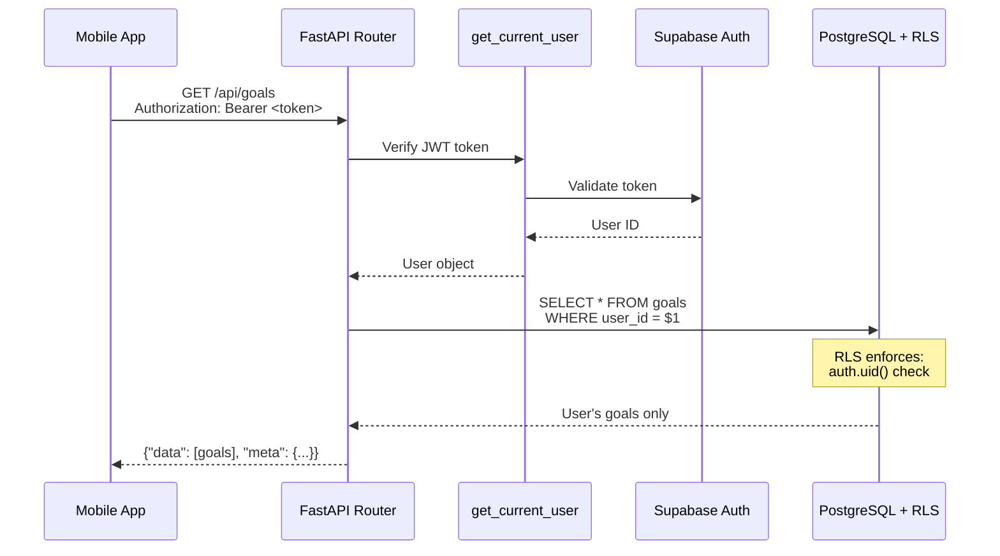

# Backend API Integration Guide

**Purpose:** Complete API endpoint registry and integration patterns for implementing Epic 2-8 features.

**Created:** 2025-12-22 (Story 1.5.2 AC-9)

---

## Table of Contents

1. [API Endpoint Registry](#api-endpoint-registry)
2. [Implementation Workflow](#implementation-workflow)
3. [Standard Patterns](#standard-patterns)
4. [Testing Patterns](#testing-patterns)
5. [Authentication & RLS Integration](#authentication--rls-integration)
6. [Examples](#examples)

---

## API Endpoint Registry

**Total: 28 API endpoints** across Epic 2-8

### Epic 2: Goal Management (5 endpoints)

| Method | Endpoint | Story | Description | Request Body | Response |
|--------|----------|-------|-------------|--------------|----------|
| GET | `/api/goals` | 2.1 | List user's active goals | - | `{"data": [goals], "meta": {...}}` |
| GET | `/api/goals/{id}` | 2.2 | Get goal details with Q-goals and binds | - | `{"data": goal, "meta": {...}}` |
| POST | `/api/goals` | 2.3 | Create new goal (AI-assisted) | `{title, description, motivation}` | `{"data": goal, "meta": {...}}` |
| PUT | `/api/goals/{id}` | 2.4 | Edit goal details | `{title?, description?, motivation?}` | `{"data": goal, "meta": {...}}` |
| PUT | `/api/goals/{id}/archive` | 2.5 | Archive goal (soft delete) | - | `{"data": goal, "meta": {...}}` |

**Router file:** `weave-api/app/api/routers/goals.py`

---

### Epic 3: Daily Actions & Proof (4 endpoints)

| Method | Endpoint | Story | Description | Request Body | Response |
|--------|----------|-------|-------------|--------------|----------|
| GET | `/api/subtask-instances?local_date={date}` | 3.1 | Today's binds by goal | Query: `local_date` (YYYY-MM-DD) | `{"data": [instances], "meta": {...}}` |
| POST | `/api/subtask-completions` | 3.3 | Mark bind complete | `{subtask_instance_id, completed_at, local_date}` | `{"data": completion, "meta": {...}}` |
| POST | `/api/captures` | 3.3, 3.4 | Upload proof (photo/video/timer) | FormData: `file`, `type`, `description?`, `linked_subtask_id?` | `{"data": capture, "meta": {...}}` |
| GET | `/api/daily-aggregates?local_date={date}` | 3.1 | Daily completion stats | Query: `local_date` (YYYY-MM-DD) | `{"data": aggregate, "meta": {...}}` |

**Router file:** `weave-api/app/api/routers/actions.py`

---

### Epic 4: Reflection & Journaling (5 endpoints)

| Method | Endpoint | Story | Description | Request Body | Response |
|--------|----------|-------|-------------|--------------|----------|
| POST | `/api/journal-entries` | 4.1 | Submit daily reflection | `{local_date, fulfillment_score, default_responses, custom_responses}` | `{"data": journal, "meta": {...}}` |
| GET | `/api/journal-entries` | 4.5 | List past journal entries | Query: `timeframe?` (7\|30\|60\|90) | `{"data": [journals], "meta": {...}}` |
| GET | `/api/journal-entries/{date}` | 4.5 | Get specific journal entry | - | `{"data": journal, "meta": {...}}` |
| POST | `/api/ai/recap` | 4.3 | Generate AI feedback (batch trigger) | `{journal_entry_id}` | `{"data": {job_id, status: "queued"}, "meta": {...}}` |
| PUT | `/api/ai-artifacts/{id}` | 4.4 | Edit AI-generated feedback | `{content, is_user_edited: true}` | `{"data": artifact, "meta": {...}}` |

**Router files:**
- `weave-api/app/api/routers/journal.py`
- `weave-api/app/api/routers/ai.py`

---

### Epic 5: Progress Visualization (2 endpoints)

| Method | Endpoint | Story | Description | Request Body | Response |
|--------|----------|-------|-------------|--------------|----------|
| GET | `/api/user-stats` | 5.1 | Overall user metrics (streak, consistency) | - | `{"data": stats, "meta": {...}}` |
| GET | `/api/daily-aggregates?timeframe={7\|30\|60\|90}` | 5.2, 5.3 | Aggregates for heat map and charts | Query: `timeframe` | `{"data": [aggregates], "meta": {...}}` |

**Router file:** `weave-api/app/api/routers/progress.py`

---

### Epic 6: AI Coaching (3 endpoints)

| Method | Endpoint | Story | Description | Request Body | Response |
|--------|----------|-------|-------------|--------------|----------|
| POST | `/api/ai/chat` | 6.1, 6.2 | Send message to Dream Self Advisor | `{message, context?}` | `{"data": {response, conversation_id}, "meta": {...}}` |
| GET | `/api/ai/chat/history` | 6.1 | Conversation history | Query: `conversation_id?`, `limit?` | `{"data": [messages], "meta": {...}}` |
| POST | `/api/ai/insights` | 6.4 | Trigger weekly pattern insights | - | `{"data": {job_id, status: "queued"}, "meta": {...}}` |

**Router file:** `weave-api/app/api/routers/ai.py`

---

### Epic 7: Notifications (4 endpoints)

| Method | Endpoint | Story | Description | Request Body | Response |
|--------|----------|-------|-------------|--------------|----------|
| POST | `/api/notifications/schedule` | 7.1 | Schedule morning intention notification | `{notification_type, scheduled_for, content}` | `{"data": notification, "meta": {...}}` |
| POST | `/api/notifications/bind-reminder` | 7.2 | Bind reminder notification | `{subtask_instance_id, reminder_time}` | `{"data": notification, "meta": {...}}` |
| POST | `/api/notifications/reflection-prompt` | 7.3 | Evening reflection prompt | - | `{"data": notification, "meta": {...}}` |
| POST | `/api/notifications/streak-recovery` | 7.4 | Streak recovery nudge | `{days_inactive}` | `{"data": notification, "meta": {...}}` |

**Router file:** `weave-api/app/api/routers/notifications.py`

---

### Epic 8: Settings & Profile (5 endpoints)

| Method | Endpoint | Story | Description | Request Body | Response |
|--------|----------|-------|-------------|--------------|----------|
| GET | `/api/user/profile` | 8.1 | Get user profile | - | `{"data": profile, "meta": {...}}` |
| PUT | `/api/user/profile` | 8.1 | Update user profile | `{name?, email?, preferences?}` | `{"data": profile, "meta": {...}}` |
| GET | `/api/user/export` | 8.3 | Data export (JSON) | - | `{"data": {download_url}, "meta": {...}}` |
| DELETE | `/api/user/account` | 8.3 | Soft delete account | `{confirmation: "DELETE"}` | `{"data": {deleted_at}, "meta": {...}}` |
| GET | `/api/subscriptions` | 8.4 | Subscription status | - | `{"data": subscription, "meta": {...}}` |

**Router files:**
- `weave-api/app/api/routers/user.py`
- `weave-api/app/api/routers/subscriptions.py`

---

## Implementation Workflow

### Step 1: Identify Your Endpoint

When implementing a story, find the corresponding endpoint in the registry above.

**Example:** Story 2.1 (View Goals List) → `GET /api/goals`

### Step 2: Locate the Route Stub

Navigate to the router file:

```bash
# Example for Epic 2
cd weave-api/app/api/routers
cat goals.py
```

You'll see a 501 stub:

```python
@router.get("/")
async def list_goals(user=Depends(get_current_user)):
    """
    Epic 2, Story 2.1: View Goals List
    TODO: Implement goal list retrieval
    """
    raise HTTPException(
        status_code=501,
        detail={
            "error": "NOT_IMPLEMENTED",
            "message": "This endpoint has not been developed",
            "epic": "Epic 2: Goal Management",
            "story": "Story 2.1: View Goals List"
        }
    )
```

### Step 3: Replace 501 Stub with Real Implementation

```python
from app.api.dependencies import get_current_user
from app.models.user import User
from app.models.goal import Goal
from sqlalchemy.ext.asyncio import AsyncSession
from app.api.dependencies import get_db

@router.get("/")
async def list_goals(
    user: User = Depends(get_current_user),
    db: AsyncSession = Depends(get_db)
):
    """
    Epic 2, Story 2.1: View Goals List

    Returns user's active goals with consistency metrics.
    """

    # Query user's active goals
    result = await db.execute(
        select(Goal)
        .where(Goal.user_id == user.id)
        .where(Goal.status == "active")
        .where(Goal.deleted_at.is_(None))
        .order_by(Goal.created_at.desc())
    )
    goals = result.scalars().all()

    # Format response
    return {
        "data": [goal.to_dict() for goal in goals],
        "meta": {
            "timestamp": datetime.utcnow().isoformat(),
            "total": len(goals)
        }
    }
```

### Step 4: Update Tests

Replace the 501 test with real integration tests:

```python
# tests/test_goals_api.py
def test_list_goals_success(client: TestClient, auth_headers, db_session):
    """Test successful goal list retrieval"""

    # Setup: Create test goals
    goal1 = create_test_goal(db_session, title="Learn Python", status="active")
    goal2 = create_test_goal(db_session, title="Exercise Daily", status="active")

    # Execute
    response = client.get("/api/goals", headers=auth_headers)

    # Assert
    assert response.status_code == 200
    data = response.json()
    assert "data" in data
    assert "meta" in data
    assert len(data["data"]) == 2
    assert data["data"][0]["title"] == "Learn Python"
    assert data["data"][1]["title"] == "Exercise Daily"

def test_list_goals_empty(client: TestClient, auth_headers):
    """Test empty goal list"""
    response = client.get("/api/goals", headers=auth_headers)
    assert response.status_code == 200
    assert response.json()["data"] == []
```

---

## Standard Patterns

### Response Format

**Success Response:**
```json
{
  "data": { ... },  // or array
  "meta": {
    "timestamp": "2025-12-22T10:00:00Z",
    "total": 10       // for lists
  }
}
```

**Error Response:**
```json
{
  "error": {
    "code": "VALIDATION_ERROR",
    "message": "Title is required",
    "retryable": false
  }
}
```

### Standard Error Codes

| Code | HTTP Status | Usage |
|------|-------------|-------|
| `VALIDATION_ERROR` | 400 | Request validation failed |
| `UNAUTHORIZED` | 401 | Missing or invalid auth token |
| `FORBIDDEN` | 403 | Authenticated but not authorized (RLS violation) |
| `NOT_FOUND` | 404 | Resource doesn't exist |
| `CONFLICT` | 409 | Resource already exists (e.g., journal entry for today) |
| `RATE_LIMIT_EXCEEDED` | 429 | User exceeded rate limit (AI calls, uploads) |
| `INTERNAL_ERROR` | 500 | Server error |

### Authentication Pattern

All endpoints use JWT authentication:

```python
from app.api.dependencies import get_current_user
from app.models.user import User

@router.get("/")
async def endpoint(user: User = Depends(get_current_user)):
    # user is guaranteed authenticated
    # user.id is available for queries
    pass
```

### RLS Integration

Database queries automatically enforce Row Level Security:

```python
# RLS enforced at database level
result = await db.execute(
    select(Goal).where(Goal.user_id == user.id)
)
# Only returns goals owned by authenticated user
```

See `docs/security-architecture.md` for complete RLS patterns.

### Rate Limiting Pattern

For AI endpoints and uploads:

```python
from app.api.dependencies import check_rate_limit

@router.post("/ai/chat")
async def chat(
    user: User = Depends(get_current_user),
    _: None = Depends(check_rate_limit("ai_text", limit=10, window="1h"))
):
    # Rate limit enforced before handler execution
    pass
```

---

## Testing Patterns

### Test File Structure

```
tests/
├── test_goals_api.py          # Epic 2
├── test_actions_api.py         # Epic 3
├── test_journal_api.py         # Epic 4
├── test_progress_api.py        # Epic 5
├── test_ai_api.py              # Epic 6
├── test_notifications_api.py   # Epic 7
└── test_user_api.py            # Epic 8
```

### Integration Test Template

```python
import pytest
from fastapi.testclient import TestClient

def test_endpoint_success(client: TestClient, auth_headers, db_session):
    """Test successful operation"""
    # Setup: Create test data
    test_data = create_test_resource(db_session, ...)

    # Execute: Call endpoint
    response = client.post("/api/endpoint", json={...}, headers=auth_headers)

    # Assert: Verify response
    assert response.status_code == 200
    data = response.json()
    assert "data" in data
    assert "meta" in data

def test_endpoint_validation_error(client: TestClient, auth_headers):
    """Test validation error handling"""
    response = client.post("/api/endpoint", json={}, headers=auth_headers)
    assert response.status_code == 400
    assert response.json()["error"]["code"] == "VALIDATION_ERROR"

def test_endpoint_unauthorized(client: TestClient):
    """Test authentication required"""
    response = client.get("/api/endpoint")
    assert response.status_code == 401

def test_endpoint_not_found(client: TestClient, auth_headers):
    """Test resource not found"""
    response = client.get("/api/endpoint/nonexistent-id", headers=auth_headers)
    assert response.status_code == 404
    assert response.json()["error"]["code"] == "NOT_FOUND"
```

### Pytest Fixtures

```python
# tests/conftest.py
@pytest.fixture
def client():
    """FastAPI test client"""
    from app.main import app
    return TestClient(app)

@pytest.fixture
def auth_headers(test_user):
    """Authentication headers for test user"""
    token = create_jwt_token(test_user.id)
    return {"Authorization": f"Bearer {token}"}

@pytest.fixture
def db_session():
    """Database session for test data setup"""
    # Setup
    session = TestSessionLocal()
    yield session
    # Teardown
    session.rollback()
    session.close()
```

---

## Authentication & RLS Integration

### JWT Token Flow



### RLS Policy Pattern

All user-owned tables use this pattern:

```sql
-- Example: goals table RLS policy
CREATE POLICY "users_manage_own_goals" ON goals
    FOR ALL
    USING (user_id IN (
        SELECT id FROM user_profiles WHERE auth_user_id = auth.uid()::text
    ));
```

**Key Points:**
- RLS enforced at database level (not application layer)
- `auth.uid()` provides authenticated user's UUID
- Lookup through `user_profiles.auth_user_id` → `user_profiles.id`
- FastAPI never needs to filter by `user_id` explicitly (RLS does this)

---

## Examples

### Example 1: List Goals (GET /api/goals)

**Full Implementation:**

```python
# weave-api/app/api/routers/goals.py
from fastapi import APIRouter, Depends, HTTPException
from sqlalchemy import select
from sqlalchemy.ext.asyncio import AsyncSession
from app.api.dependencies import get_current_user, get_db
from app.models.user import User
from app.models.goal import Goal
from typing import List
from datetime import datetime

router = APIRouter(prefix="/api/goals", tags=["goals"])

@router.get("/")
async def list_goals(
    user: User = Depends(get_current_user),
    db: AsyncSession = Depends(get_db)
):
    """
    Epic 2, Story 2.1: View Goals List

    Returns user's active goals with metadata.
    RLS automatically filters by user_id.
    """

    # Query active goals (RLS enforces user_id filter)
    result = await db.execute(
        select(Goal)
        .where(Goal.status == "active")
        .where(Goal.deleted_at.is_(None))
        .order_by(Goal.created_at.desc())
    )
    goals = result.scalars().all()

    # Format response
    return {
        "data": [
            {
                "id": str(goal.id),
                "title": goal.title,
                "description": goal.description,
                "status": goal.status,
                "created_at": goal.created_at.isoformat(),
                "binds_count": len(goal.subtask_templates),
                "consistency_percent": goal.computed_consistency_percent
            }
            for goal in goals
        ],
        "meta": {
            "timestamp": datetime.utcnow().isoformat(),
            "total": len(goals)
        }
    }
```

**Test:**

```python
# tests/test_goals_api.py
def test_list_goals(client, auth_headers, db_session):
    # Setup
    goal = Goal(
        user_id=test_user_id,
        title="Learn Python",
        description="Master async/await",
        status="active"
    )
    db_session.add(goal)
    db_session.commit()

    # Execute
    response = client.get("/api/goals", headers=auth_headers)

    # Assert
    assert response.status_code == 200
    data = response.json()
    assert len(data["data"]) == 1
    assert data["data"][0]["title"] == "Learn Python"
    assert "meta" in data
```

---

### Example 2: Create Goal (POST /api/goals)

**Full Implementation:**

```python
from pydantic import BaseModel, Field

class GoalCreate(BaseModel):
    title: str = Field(..., min_length=1, max_length=200)
    description: str = Field(..., max_length=2000)
    motivation: str = Field(..., max_length=500)

@router.post("/")
async def create_goal(
    goal_data: GoalCreate,
    user: User = Depends(get_current_user),
    db: AsyncSession = Depends(get_db)
):
    """
    Epic 2, Story 2.3: Create New Goal (AI-Assisted)

    Creates goal with AI-generated Q-goals and binds.
    """

    # Check 3-goal limit
    result = await db.execute(
        select(func.count(Goal.id))
        .where(Goal.status == "active")
        .where(Goal.deleted_at.is_(None))
    )
    active_count = result.scalar()

    if active_count >= 3:
        raise HTTPException(
            status_code=409,
            detail={
                "error": "GOAL_LIMIT_REACHED",
                "message": "Maximum 3 active goals allowed",
                "retryable": False
            }
        )

    # Call AI Orchestrator to generate goal breakdown
    from app.services.ai.ai_orchestrator import get_orchestrator
    orchestrator = get_orchestrator()

    ai_result = await orchestrator.execute_ai_operation(
        user_id=str(user.id),
        operation_type="generate_goal_breakdown",
        params={
            "title": goal_data.title,
            "description": goal_data.description,
            "motivation": goal_data.motivation
        }
    )

    # Create goal with AI-generated Q-goals
    goal = Goal(
        user_id=user.id,
        title=goal_data.title,
        description=goal_data.description,
        motivation=goal_data.motivation,
        status="active"
    )
    db.add(goal)
    await db.flush()

    # Create Q-goals and binds from AI output
    for qgoal_data in ai_result["qgoals"]:
        qgoal = QGoal(
            goal_id=goal.id,
            title=qgoal_data["title"],
            metric=qgoal_data["metric"],
            target_value=qgoal_data["target"]
        )
        db.add(qgoal)

    await db.commit()
    await db.refresh(goal)

    return {
        "data": goal.to_dict(),
        "meta": {"timestamp": datetime.utcnow().isoformat()}
    }
```

---

## Next Steps

1. **When implementing Epic 2-8 stories:**
   - Reference this guide for endpoint specifications
   - Copy endpoint stubs from router files
   - Follow standard patterns for responses, errors, auth
   - Write integration tests before implementation

2. **When adding new endpoints (post-MVP):**
   - Add to this registry
   - Follow naming conventions (`/api/{resource}`)
   - Use standard response format
   - Create corresponding tests

3. **Documentation updates:**
   - Keep this file in sync with `docs/dev/backend-patterns-guide.md`
   - Update `CLAUDE.md` when new patterns emerge

---

## References

- **Backend Patterns Guide:** `docs/dev/backend-patterns-guide.md` (Story 1.5.2 AC-1 to AC-8)
- **AI Services Guide:** `docs/dev/ai-services-guide.md` (Story 1.5.3)
- **Security Architecture:** `docs/security-architecture.md` (Story 0.4 - RLS)
- **Epic Stories:** `docs/prd/epic-{2-8}-*.md`

**Created:** 2025-12-22
**Story:** 1.5.2 AC-9 (API Endpoint Mapping)
**Maintainer:** Development Team
