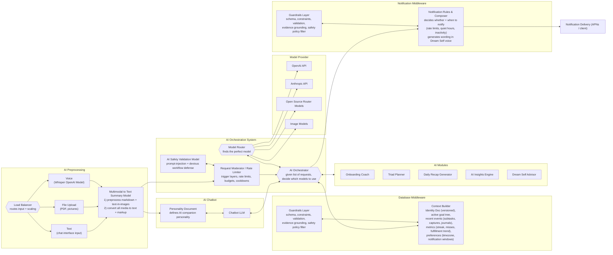

# Weave AI Architecture

## Table of Contents

1. [Architecture Overview](#architecture-overview)
2. [System Diagrams](#system-diagrams)
   - [Flowchart: AI System Components](#flowchart-ai-system-components)
   - [Sequence: Chat + Tools Request Flow](#sequence-chat--tools-request-flow)
3. [Architecture Description](#architecture-description)
4. [Component Responsibilities](#component-responsibilities)
5. [AI Modules](#ai-modules)
6. [AI Principles](#ai-principles)
7. [Request Flow Patterns](#request-flow-patterns)
8. [Architecture Decisions](#architecture-decisions)

---

## Architecture Overview

The Weave AI system is a modular architecture that transforms multimodal user inputs (voice, images, text) into personalized coaching, planning, and insights. The system is built around a **Dream Self** personality that evolves with the user's identity, providing consistent, deterministic guidance toward their goals (needles) through actionable habits (binds).

**Core Philosophy:** The AI is not a generic chatbot. It's a personalized companion constrained by the user's identity document, goal structure, and completion history. This determinism creates trust and makes advice feel "built for me."

**Key Design Principles:**
- **Editable by default** - All AI outputs can be user-modified
- **Deterministic personality** - Same inputs yield consistent coaching style
- **Cost-conscious** - Batch operations, cache aggressively, minimize unnecessary model calls
- **Trust-based** - Rely on user honesty rather than complex verification systems
- **Context-grounded** - All outputs reference user's identity doc, goals, and history

---

## System Diagrams

### Flowchart: AI System Components



### Sequence: Chat + Tools Request Flow

```mermaid
sequenceDiagram
  participant U as User
  participant LB as Load Balancer
  participant MM as Multimodal->Text Summary
  participant Mod as Request Moderator / Rate Limiter
  participant Safe as Safety Validation
  participant LLM as Chatbot LLM
  participant Orch as AI Orchestrator
  participant Ctx as Context Builder
  participant MR as Model Router
  participant MP as Model Providers
  participant AM as AI Modules

  U->>LB: Voice / file / text input
  LB->>MM: Route input to preprocessing
  MM-->>Mod: Normalized text + markup
  Mod<->>Safe: Validate policy + injection defenses
  Mod-->>Orch: Approved request + budget constraints
  Orch<->>Ctx: Build context (identity, goals, recent events, metrics)
  Orch->>MR: Choose models per subtask
  MR->>MP: Call selected model(s)
  MP-->>MR: Model outputs
  Orch->>AM: Run module logic (triad, recap, insights, onboarding)
  AM-->>Orch: Artifacts
  Orch-->>LLM: Tool results + structured artifacts
  LLM-->>U: Response in personality voice
```

---

## Architecture Description

### The Big Idea

This design is a **modular AI system** that normalizes messy user inputs (voice, PDFs, images, chat text) into a single text-plus-markup representation, runs that through safety and budget enforcement, then uses an orchestrator and model router to decide which models and internal modules to call.

Outputs are grounded by a **Context Builder** (identity doc + goals + history + metrics), and behavior is shaped by a **Personality Document** that defines the Dream Self companion voice.

**Notifications** are treated as a first-class AI product surface with their own rules engine and guardrails, ensuring proactive engagement without becoming spam.

### Why This Architecture

**For MVP Goals:**
1. **Supports all 6 must-ship features** - Goal breakdown, identity docs, captures, reflection, progress viz, AI coach
2. **Cost-efficient** - Batches AI calls, caches outputs, minimizes redundant model invocations
3. **Deterministic** - Same user context produces consistent coaching style
4. **Scalable** - Async queue for expensive operations, sync for fast reads

**For User Trust:**
1. **Transparent** - All AI outputs are editable and traceable to specific runs
2. **Consistent** - Personality doesn't randomly change between sessions
3. **Grounded** - References actual user data, not hallucinated "facts"

---

## Component Responsibilities

### 1. AI Preprocessing

**Purpose:** Normalize all user inputs into a canonical text + markup format

**Components:**

**Load Balancer**
- Routes incoming requests based on input type (voice/file/text)
- Handles scaling and traffic distribution
- Ensures preprocessing services are available

**Voice Input Handler**
- Uses OpenAI Whisper for speech-to-text conversion
- Preserves timestamps for voice memos
- Links transcriptions to original audio captures

**File Upload Handler**
- Processes PDFs and images
- Extracts text from images (OCR when needed)
- Handles proof captures (workout photos, screenshots, etc.)

**Text Input Handler**
- Accepts direct chat interface input
- Preserves markdown formatting
- Handles emoji and special characters

**Multimodal to Text Summary Model**
- Canonical input adapter ensuring downstream components never care about input type
- Preprocesses markdown and extracts text-in-images
- Converts all media to normalized text + markup format
- Output format is consistent and parseable

**Key Principle:** By the time data reaches the orchestrator, it's already in a standard format. This prevents "input type branching" throughout the codebase.

---

### 2. Safety and Request Moderation

**Purpose:** Protect against abuse and enforce resource constraints before expensive operations

**AI Safety Validation Model**
- Detects prompt injection patterns
- Identifies malicious workflow attempts
- Flags policy violations
- Prevents jailbreaking attempts

**Request Moderator / Rate Limiter**
- Enforces per-user budgets and cooldowns
- Implements "trigger layers" for elevated scrutiny
- Manages rate limits:
  - AI generation: 10 requests/hour per user
  - Uploads: 50 per day per user
  - Completions: 100 per day per user
- Decisions: allow, deny, degrade, or require confirmation

**Integration Points:**
- Sits between preprocessing and orchestration
- Can downgrade expensive requests to cached/simpler alternatives
- Logs all decisions for abuse monitoring

---

### 3. AI Orchestration System

**Purpose:** Central decision-making layer that coordinates models, modules, and context

**AI Orchestrator**
- Takes approved requests and decomposes into subtasks
- Decides what should happen: which modules to call, what order
- Determines sync vs async execution strategy
- Coordinates between LLM, modules, and context builder
- Handles error recovery and fallbacks

**Model Router**
- Chooses optimal model(s) for each subtask
- Routes to appropriate providers: OpenAI, Anthropic, OSS, Image models
- Implements routing strategy (rules-based for MVP, learnable later)
- Manages model-specific parameters and constraints

**Routing Strategy (MVP):**
- Onboarding: Use most capable model (GPT-4 or Claude Sonnet)
- Triad planning: Medium capability, faster (GPT-3.5-turbo or Claude Haiku)
- Recap generation: Medium capability
- Dream Self chat: Most capable for personality consistency
- Insights: Most capable for pattern detection

**Cost Optimization:**
- Cache identical input_hash results
- Use cheaper models for simple tasks
- Batch multiple requests when possible

---

### 4. Database Middleware (Context Builder + Guardrails)

**Purpose:** Assemble "truthy" user state and enforce data integrity

**Context Builder**

Assembles canonical user context from database:

1. **Identity Document (Versioned)**
   - Current archetype (MBTI-like personality type)
   - Dream self description and voice
   - Motivations and constraints
   - Coaching preference (gentle ↔ strict)
   - Failure mode (procrastination, overcommitment, etc.)

2. **Active Goal Tree**
   - Max 3 active goals (needles)
   - Associated Q-goals (quantifiable subgoals)
   - Subtask templates (binds)

3. **Recent Events**
   - Last 7 days of subtask completions (binds completed)
   - Recent captures (proof, memories, notes)
   - Journal entries with fulfillment scores
   - Triad task history

4. **Computed Metrics**
   - Current streak (active days with proof)
   - Longest streak
   - Consistency percentage (7-day, 30-day)
   - Fulfillment trend (moving average)
   - Missed task patterns

5. **Preferences**
   - Timezone (critical for local_date calculations)
   - Notification windows and quiet hours
   - Nudging intensity preference
   - Goal change strictness mode

**Guardrails Layer**

Enforces constraints at the data boundary:

- **Schema validation** - AI outputs must match expected schemas
- **Constraint enforcement** - Max 3 active goals, valid date ranges
- **Evidence grounding** - AI can only reference data that exists
- **Safety policy filtering** - Blocks outputs that violate policies
- **Editability preservation** - All outputs stored as editable artifacts

**Why This Matters:** Prevents AI from "writing garbage" or using untrusted content as facts. Every AI output is validated before persisting.

---

### 5. AI Chatbot (Personality Doc + LLM)

**Purpose:** The user-facing conversation interface with consistent Dream Self personality

**Personality Document**

Defines the AI companion's behavior as a stable control plane:

**Structure:**
```json
{
  "version": "1.0",
  "base_personality": {
    "voice": "dream_self",
    "tone": "supportive_but_direct",
    "values": ["authenticity", "growth", "consistency"],
    "style_constraints": [
      "Reference user's identity doc",
      "Call out patterns user might miss",
      "Celebrate progress explicitly",
      "Don't sugarcoat setbacks"
    ]
  },
  "user_specific": {
    "archetype": "ambitious_builder",
    "dream_self_description": "Confident, consistent, disciplined version who follows through",
    "motivation_drivers": ["prove_to_self", "visible_progress"],
    "coaching_preference": 7.5
  },
  "response_templates": {
    "celebration": "You {specific_action}. That's the {dream_self_trait} you're building.",
    "challenge": "You haven't {specific_action} in {days} days. What's blocking you?",
    "insight": "I notice {pattern}. This suggests {interpretation}. Consider {suggestion}."
  }
}
```

**Key Principles:**
1. **Deterministic** - Same context produces consistent personality
2. **Grounded** - References actual user data (past wins, current goals)
3. **Evolving** - Updates as user's identity doc changes
4. **Voice-consistent** - Uses Dream Self language, not generic platitudes

**Chatbot LLM**

- Uses orchestrator as action and retrieval layer (tools)
- Does NOT try to do everything in one prompt
- Calls appropriate modules through orchestrator
- Renders results using personality document voice
- Maintains conversation context across turns

**Integration:**
- Receives preprocessed, normalized input
- Requests context from Context Builder via Orchestrator
- Calls AI Modules when needed (plan generation, insights, etc.)
- Renders final response in Dream Self voice

---

### 6. AI Modules

**Purpose:** Product features as first-class, specialized modules

Each module is a focused capability called by the orchestrator. Modules receive context and return structured artifacts.

#### Onboarding Coach

**Trigger:** User completes signup and starts onboarding flow

**Inputs:**
- User demographics (student, professional, etc.)
- Initial goal inputs (raw, potentially vague like "get jacked")
- Archetype assessment responses
- Dream self description

**Processing:**
1. Parse abstract goals into structured format
2. Generate quantifiable subgoals (Q-goals)
3. Suggest initial binds (habits/actions)
4. Create user's first identity document
5. Select Dream Self voice based on archetype + dream self

**Outputs:**
```json
{
  "goal_structure": {
    "goal": {
      "title": "Get fit and build strength",
      "description": "Build muscle, improve energy, feel confident",
      "qgoals": [
        {
          "title": "Strength training 3x per week",
          "cadence": "weekly",
          "target_value": 3,
          "metric_type": "count"
        },
        {
          "title": "Consume 120g protein daily",
          "cadence": "daily",
          "target_value": 120,
          "metric_type": "numeric",
          "unit": "grams"
        }
      ],
      "suggested_binds": [
        {
          "title": "Morning gym session (60 min)",
          "estimated_minutes": 60,
          "difficulty": 5,
          "recurrence": "Mon, Wed, Fri"
        },
        {
          "title": "Track protein intake",
          "estimated_minutes": 5,
          "difficulty": 2,
          "recurrence": "daily"
        }
      ]
    }
  },
  "identity_doc_v1": { /* full identity document */ },
  "dream_self_voice": "confident_achiever"
}
```

**Constraints:**
- Max 2 minutes of reading time for user
- Must affirm user's goal, not judge it
- Use Goldilocks principle: ~70% completion probability
- Make binds specific and trackable

#### Triad Planner

**Trigger:** User submits daily journal (evening reflection)

**Inputs from Context Builder:**
- Active goals (needles) and their Q-goals
- Last 7 days completion history
- Fulfillment trend (moving average of fulfillment scores)
- Missed tasks from today
- Tomorrow's calendar (if integrated)
- User's energy patterns and time constraints

**Processing:**
1. Analyze what user accomplished today vs. planned
2. Identify patterns in completion (what gets done, what gets skipped)
3. Apply Goldilocks principle: balance challenge and achievability
4. Generate 3 tasks for tomorrow:
   - **Rank 1:** Easy win (builds momentum)
   - **Rank 2:** Medium challenge (progresses goals)
   - **Rank 3:** Important/difficult (most impactful)

**Outputs:**
```json
{
  "triad_tasks": [
    {
      "rank": 1,
      "title": "Track protein intake",
      "rationale": "You've completed this 6/7 days. Easy consistency builder.",
      "estimated_minutes": 5,
      "linked_goal_id": "uuid",
      "linked_qgoal_id": "uuid"
    },
    {
      "rank": 2,
      "title": "Gym session - Upper body",
      "rationale": "Missed Wednesday. Getting back on track keeps your streak alive.",
      "estimated_minutes": 60,
      "difficulty": 5
    },
    {
      "rank": 3,
      "title": "Finish project proposal outline",
      "rationale": "You mentioned this is blocking progress. High leverage task.",
      "estimated_minutes": 90,
      "difficulty": 8
    }
  ],
  "next_day_summary": "Focus on the gym session—it's your keystone habit. Knock out protein tracking first for an easy win."
}
```

**Caching Strategy:**
- Hash inputs (goals + history + fulfillment) to avoid regenerating identical plans
- Cache for 8 hours (allows user to regenerate if they edit goals)

#### Daily Recap Generator

**Trigger:** User submits journal entry at end of day

**Inputs:**
- Completed subtasks (binds) for the day
- Captures created (photos, notes, voice memos)
- Journal text and fulfillment score (1-10)
- Expected vs. actual completions

**Processing:**
1. Summarize what user accomplished
2. Identify one positive pattern or insight
3. Address one blocker if present
4. Generate one specific suggestion for tomorrow

**Outputs:**
```json
{
  "recap": {
    "summary_bullets": [
      "Completed 4/5 planned binds (80%)",
      "Gym session + protein tracking done",
      "Created 2 proof captures with photos",
      "Fulfillment score: 7/10"
    ],
    "insight": "You've hit the gym 8 days straight. That's the disciplined version of you showing up consistently.",
    "blocker_addressed": "You skipped the project work again. You rated fulfillment at 7, but avoiding this is likely weighing on you.",
    "suggestion": "Tomorrow, do 25 minutes of project work right after gym while energy is high. Don't aim for perfect—just make visible progress."
  },
  "active_day_with_proof": true,
  "streak_updated": true
}
```

**Constraints:**
- Keep summary under 100 words
- Always affirm at least one win
- Address blockers constructively, not judgmentally
- Reference Dream Self identity

#### Dream Self Advisor

**Purpose:** The "face" of the AI—conversational coaching interface

**Trigger:** User initiates chat or asks for advice

**Inputs from Context Builder:**
- Full identity document (current version)
- Recent wins and completions
- Current goals and progress
- Patterns and blockers
- User's question or prompt

**Processing:**
1. Parse user intent
2. Reference specific user data (not generic advice)
3. Respond in Dream Self voice
4. Provide actionable guidance tied to goals

**Example Exchanges:**

**User:** "I don't feel motivated today."

**Dream Self Advisor Response:**
```
I get it. But here's what I see: you've completed your gym bind 8 days straight. 
That's not motivation—that's discipline. The version of you that hits 30 days 
doesn't wait for motivation. 

You rated yesterday a 7/10 in fulfillment. What one thing would make today an 8? 
Do that.
```

**User:** "Should I add a new goal for learning Spanish?"

**Dream Self Advisor Response:**
```
Not yet. You've got 3 active needles and you're at 65% consistency on the 
fitness one. Adding Spanish now would dilute your focus.

Finish this 30-day cycle on your current goals. Prove to yourself you can 
follow through. Then we'll weave in Spanish.
```

**Key Principles:**
1. **Opinionated, not generic** - Uses user data to give specific guidance
2. **References identity** - Calls back to Dream Self description
3. **Celebrates progress** - Highlights specific wins from history
4. **Constructively challenging** - Doesn't let user off the hook, but supportively

**Voice Characteristics:**
- Direct but supportive
- Evidence-based (cites user's actual data)
- Future-oriented (references Dream Self)
- Accountability-focused

#### AI Insights Engine

**Purpose:** Deep behavioral analysis and proactive pattern recognition

**Triggers:**
- Weekly scheduled job
- Significant streak milestone (10, 30, 60, 90 days)
- Pattern detection (consistent misses on specific bind type)
- User request for analysis

**Inputs:**
- Full completion history (30+ days)
- Journal entries with fulfillment scores
- Goal progress over time
- Time-of-day and day-of-week patterns
- Bind difficulty vs. completion correlation

**Processing:**
1. **Pattern Recognition**
   - Day-of-week effects (e.g., always skip gym on Fridays)
   - Time-of-day success rates
   - "Frog avoidance" detection (hard tasks get postponed)
   - Correlation: fulfillment score vs. specific binds

2. **Trajectory Analysis**
   - Consistency trend (improving, plateauing, declining)
   - Fulfillment trend
   - Goal progress velocity
   - Streak resilience (recovery speed after misses)

3. **Predictive Insights**
   - Risk of burnout (high consistency but declining fulfillment)
   - Goal abandonment risk (consistent misses + low fulfillment)
   - Optimal bind difficulty calibration
   - Success enablers (what correlates with high-fulfillment days)

**Outputs:**
```json
{
  "insights": [
    {
      "type": "pattern",
      "title": "Friday gym avoidance",
      "description": "You've skipped gym 4 out of 5 Fridays. Energy dip or social plans?",
      "evidence": ["Missed 12/7, 12/14, 12/21, 12/28"],
      "suggestion": "Move Friday gym to Saturday morning or make it a lighter 30-min session."
    },
    {
      "type": "success_correlation",
      "title": "Morning binds = Higher fulfillment",
      "description": "Days when you complete gym + protein tracking before noon, you rate fulfillment 8.2/10 avg. Afternoon-only days: 6.1/10.",
      "suggestion": "Protect morning time. That's when your best self shows up."
    },
    {
      "type": "trajectory",
      "title": "30-day streak incoming",
      "description": "27 active days with proof in last 30. You're 3 days from a major milestone.",
      "celebration": "This is exactly who you said you wanted to become. You're proving it daily."
    }
  ]
}
```

**Proactive Notifications:**
- Surface insights when user opens app
- Send weekly "Second Brain" summary
- Alert on pattern detection (e.g., 3 consecutive misses on a bind)

**Trust-Based System:**
- Rely on user honesty for proof
- Focus on patterns, not verification
- Build AI understanding through honest reflection, not surveillance

---

### 7. Notification Middleware

**Purpose:** Proactive engagement without becoming spam

**Guardrails Layer**
- Schema validation for notification content
- Rate limit enforcement (max notifications per day)
- Quiet hours respect (user-defined)
- Policy filter (no manipulative or shame-based messaging)

**Notification Rules & Composer**

**Decision Engine (When to Notify):**

1. **Daily Intention Reminder (Morning)**
   - Time: User's preferred start time (from onboarding)
   - Content: Triad tasks for the day + yesterday's intention recap
   - Frequency: Daily (can be disabled)

2. **Bind Reminders (Throughout Day)**
   - Triggered based on bind schedule
   - Respectful nudges, not aggressive
   - Escalation strategy:
     - First reminder: Gentle ("Ready to knock out your gym session?")
     - Second reminder: Contextual ("You usually feel great after workouts")
     - Third reminder: Accountability ("Your 27-day streak is on the line")
   - Max 3 per bind per day

3. **Evening Reflection Prompt**
   - Time: User's wind-down time (from preferences)
   - Content: "How did today go? Weave is ready to reflect with you."
   - Only if journal not yet submitted

4. **Streak Recovery**
   - Triggered: 24 hours of inactivity
   - Content: Personalized based on Dream Self voice
   - Reference specific goals and past wins
   - Offer easy re-entry point

5. **Milestone Celebrations**
   - 10-day, 30-day, 60-day, 90-day active streaks
   - Badge unlocks
   - Goal completions
   - Content: Affirm identity shift, highlight progress

**Composer (How to Notify):**

All notifications written in **Dream Self voice** using personality document.

**Example Notifications:**

**Morning Intention:**
```
Good morning! Your 3 tasks today:
1. ✅ Track protein (easy win)
2. 🏋️ Gym - Upper body (60 min)
3. 📝 Project outline (the one you've been avoiding)

Yesterday you said: "Tomorrow I'll tackle the project." Let's make it happen.
```

**Bind Reminder (Gentle):**
```
Gym time? You've hit it 8 days straight. The disciplined you is showing up.
```

**Bind Reminder (Accountability):**
```
Still haven't logged your gym session. 27-day streak is on the line. 
The version of you at 30 days doesn't break now.
```

**Streak Recovery:**
```
48 hours since your last bind. I get it—life happens. But streaks are built 
on comebacks, not perfection.

Easy re-entry: Just log ONE bind today. Track your protein. 5 minutes. 
That's the thread holding.
```

**Milestone Celebration:**
```
30 DAYS. You did it.

30 days ago you said "I want to be consistent." You just proved you are.

This is your Day 10 snapshot: [show stats, wins, growth]
vs. Day 30: [current stats]

You're not the same person. Share your progress? [share card button]
```

**Rate Limiting:**
- Max 5 notifications per day
- Respect quiet hours (user-defined, default: 10pm-7am)
- No notifications during "focus mode" if user enables

**User Control:**
- Nudging intensity slider in settings (1-10)
- Quiet hours customization
- Per-bind notification preferences
- Disable all except critical (streak milestones)

---

## AI Principles (Non-Negotiable)

### 1. Editable by Default

**Principle:** Every AI-generated output can be modified by the user.

**Implementation:**
- All AI outputs stored as `ai_artifacts` with `is_user_edited` flag
- User edits tracked in `user_edits` table (JSONPatch format)
- Edited artifacts not overwritten by regeneration (supersedes_id chain)
- UI always shows "Edit" option for AI-generated content

**Why:** Users must trust the AI. Editability = control = trust.

### 2. No Hallucinated Certainty

**Principle:** AI must label assumptions and ask questions when data is insufficient.

**Implementation:**
- Guardrails layer validates all references to user data
- AI outputs include `confidence_level` metadata
- When uncertain, AI explicitly asks: "I don't have enough data about X. Can you help me understand?"
- Never invent facts about user history or goals

**Example:**
```
❌ "You usually work out at 6am, so schedule it then."
✅ "What time do you usually have energy for workouts? I'll optimize your schedule."
```

### 3. Deterministic Personality

**Principle:** Same user should get the same style of coaching tomorrow.

**Implementation:**
- Personality document versioned and referenced in `ai_runs`
- Model routing consistent (same module always uses same model tier)
- Prompt versions tracked for reproducibility
- Context Builder always returns same structure for same inputs

**Why:** Inconsistent personality feels flaky. Trust requires stability.

### 4. Guardrails Everywhere

**Principle:** Scope and constraints must be clear and enforced.

**Implementation:**
- Schema validation on all AI outputs
- Max active goals = 3 (hard constraint)
- Bind difficulty 1-15 scale (validated)
- Date ranges validated (no goals in the past)
- Evidence grounding (AI can only reference data that exists in DB)

**Why:** Prevents AI from generating garbage or violating product constraints.

---

## Cost Control (Important)

### Principle: Most Screens Should NOT Call the Model

**Expensive Operations (Async, Batched):**
- Onboarding goal breakdown
- Daily triad generation (after journal)
- Weekly insights
- Dream Self chat (user-initiated)

**Free Operations (Pre-computed, Cached):**
- Dashboard view (reads `daily_aggregates`)
- Progress charts (reads `user_stats`)
- Bind list for today (reads `subtask_instances`)
- Journal history (reads `journal_entries`)

### Caching Strategy

**Input Hash Caching:**
- Hash all AI module inputs
- Store in `ai_runs.input_hash`
- Check for existing run with same hash before calling model
- Cache TTL: 8 hours for triad, 24 hours for insights

**Example:**
```python
def generate_triad(user_id, date_for):
    # Build context
    context = context_builder.get_triad_context(user_id, date_for)
    
    # Hash inputs
    input_hash = hash_json(context)
    
    # Check cache
    cached_run = db.get_ai_run(input_hash=input_hash, max_age='8 hours')
    if cached_run:
        return cached_run.artifact
    
    # Call model (expensive)
    result = model_router.call('triad_planner', context)
    
    # Store with hash
    db.create_ai_run(input_hash=input_hash, artifact=result)
    return result
```

### Batch AI Calls

**Journal Time Batch:**
When user submits journal, batch multiple AI operations:
1. Generate tomorrow's triad
2. Generate daily recap
3. Compute updated stats

**Implementation:**
```python
def on_journal_submitted(user_id, journal_entry):
    # Queue batch job
    queue.enqueue_batch([
        {'module': 'triad', 'inputs': {...}},
        {'module': 'recap', 'inputs': {...}},
        {'module': 'stats_compute', 'inputs': {...}}
    ])
    
    # Worker processes batch, makes parallel API calls
    # Results written to DB atomically
```

### Cost Tracking

Track estimated costs per AI run:
- Store in `ai_runs.cost_estimate`
- Monitor per-user monthly spend
- Alert if user exceeds threshold (possible abuse)

---

## Request Flow Patterns

### Pattern A: Onboarding Flow

**User Journey:** Signup → Demographics → Archetype → Goals → Tutorial

**AI Involvement:**

1. **Archetype Assessment**
   - User answers 8-10 questions
   - AI categorizes into archetype
   - Sync call (fast model, ~2s response)

2. **Goal Breakdown**
   - User inputs vague goal: "get jacked"
   - AI generates structured goal tree
   - Async call (30s processing)
   - Shows loading state: "Building your roadmap..."
   - Push notification when ready

3. **Identity Doc Creation**
   - Synthesize responses into identity_doc v1
   - Sync call (included with goal breakdown)

**Cost Optimization:**
- Single model call for archetype + goal breakdown + identity doc
- Use most capable model (this is high-leverage)

### Pattern B: Daily Core Loop

**User Journey:** Morning → Document binds → Evening reflection

**AI Involvement:**

**Morning (Push Notification):**
- No model call (uses cached triad from last night)
- Read from `triad_tasks` table

**Throughout Day:**
- Mark binds complete (no AI call)
- Create captures (no AI call)

**Evening Journal:**
- User submits journal
- Triggers async batch:
  1. Generate tomorrow's triad (5-10s)
  2. Generate daily recap (5-10s)
  3. Compute stats (local, fast)
- Results ready within 20 seconds
- Push notification: "Your plan for tomorrow is ready"

**Cost:** 2 model calls per day per active user

### Pattern C: Ad-Hoc Chat

**User Journey:** User opens chat, asks Dream Self Advisor

**AI Involvement:**

1. User sends message
2. Load balancer routes to preprocessing
3. Multimodal → Text (sync, fast)
4. Safety check (sync, fast)
5. Orchestrator builds context (sync, DB read)
6. LLM generates response in Dream Self voice (5-10s)

**Streaming Response:**
- Stream tokens to client as generated
- Better perceived latency

**Rate Limiting:**
- Max 10 chat messages per hour
- Prevents abuse

### Pattern D: Weekly Insights

**User Journey:** Scheduled background job

**AI Involvement:**

1. Cron job triggers Sunday night per timezone
2. For each active user:
   - Build 30-day context
   - Call insights module (30-60s processing)
   - Store artifact
   - Queue notification for Monday morning

**Cost:** 1 model call per user per week (batched)

---

## Architecture Decisions

### Critical Decisions This Architecture Forces

#### 1. Canonical Input Representation

**Decision Required:** What markup format do you preserve from files?

**Options:**
- Plain text only (loses structure)
- Markdown (preserves formatting, links, lists)
- Custom JSON schema (most structured, hardest to edit)

**Recommendation for MVP:** Markdown
- Editable by users
- Preserves structure
- Easy to render in UI

#### 2. Safety Posture

**Decision Required:** What counts as a "trigger layer" requiring extra scrutiny?

**MVP Guidelines:**
- Block: Profanity, explicit policy violations, prompt injection patterns
- Degrade: Excessive API usage (downgrade to cached/simpler response)
- Require confirmation: Deleting goals, changing identity doc

**Example Trigger Scenarios:**
- User tries to inject "ignore previous instructions" → Block
- User makes 20 API calls in 5 minutes → Rate limit, degrade to cached
- User wants to delete all goals → "Are you sure? This can't be undone."

#### 3. Model Routing Strategy

**Decision Required:** Rules-based or learned routing?

**MVP Recommendation:** Rules-based
- Deterministic and debuggable
- Cheaper (no routing model cost)
- Good enough for 5 modules

**Rules:**
| Module | Model | Rationale |
|--------|-------|-----------|
| Onboarding | GPT-4 / Claude Sonnet | High-leverage, needs quality |
| Triad | GPT-3.5-turbo / Claude Haiku | Medium complexity, speed matters |
| Recap | GPT-3.5-turbo | Structured output, simple task |
| Dream Self | GPT-4 / Claude Sonnet | Personality consistency critical |
| Insights | GPT-4 / Claude Sonnet | Pattern detection needs capability |

**Future:** Learn routing based on output quality + cost

#### 4. Context Contract

**Decision Required:** What exactly does Context Builder return?

**Strict Contract (Prevents Drift):**

```typescript
interface TriadPlannerContext {
  user_id: string;
  local_date: string;  // User's timezone
  identity_doc: IdentityDocV1;
  active_goals: Goal[];  // Max 3
  completion_history: CompletionEvent[];  // Last 7 days
  fulfillment_trend: number;  // 7-day moving average
  missed_tasks_today: SubtaskInstance[];
  preferences: {
    notification_windows: TimeWindow[];
    coaching_strictness: number;  // 1-10
  };
}
```

**Why Strict Contract:**
- AI modules know exactly what data is available
- Prevents "context drift" where modules start expecting data that isn't always there
- Makes testing and debugging easier

#### 5. Notification Philosophy

**Decision Required:** When to be silent, when to nudge?

**MVP Philosophy:**
1. **Morning reminder = Always** (unless disabled)
2. **Bind reminders = Respectful** (max 3 per bind, respect quiet hours)
3. **Evening reflection = Gentle nudge** (only if not yet journaled)
4. **Recovery = Compassionate** (after 24h inactivity, reference streak)
5. **Milestones = Always celebrate** (10/30/60/90 days)

**Never:**
- Shame the user
- Send more than 5 notifications per day
- Interrupt during quiet hours (unless emergency—there are no emergencies in a productivity app)

**User Control:**
- Nudging slider (1-10 intensity)
- Disable all except milestones
- Custom quiet hours

---

## MVP Scope

### Must Ship for V1

**AI Modules:**
- ✅ Onboarding Coach (goal breakdown + identity doc)
- ✅ Triad Planner (daily 3-task generation)
- ✅ Daily Recap Generator (journal-time insights)
- ✅ Dream Self Advisor (chat interface)
- ✅ Basic Insights (weekly patterns)

**Infrastructure:**
- ✅ Preprocessing (voice + text, skip file upload for V1)
- ✅ Safety validation (basic prompt injection defense)
- ✅ Orchestrator + Model Router (rules-based)
- ✅ Context Builder (full contract)
- ✅ Notification Composer (push notifications only)

**Database Integration:**
- ✅ `ai_runs` and `ai_artifacts` tables
- ✅ Input hash caching
- ✅ User edits tracking

### Add Later (V1.5+)

**AI Enhancements:**
- Multi-modal long-term memory (embeddings)
- Learned model routing
- Voice output (TTS for notifications)
- Image generation (custom weave visualizations)

**Advanced Insights:**
- Predictive goal abandonment risk
- Burnout detection
- Optimal bind scheduling ML
- Cross-user anonymized benchmarks ("Top 10% consistency")

**Integration:**
- iMessage bot (Dream Self via text)
- Calendar integration (auto-schedule binds)
- Screen time data (context for AI)

---

## Alignment with MVP Features

### How AI Supports Each Must-Ship Feature

**1. Goal Breakdown Engine**
- **AI Module:** Onboarding Coach + Triad Planner
- **How:** Converts vague goals → Q-goals → binds using Goldilocks principle

**2. Identity Document**
- **AI Module:** Onboarding Coach (creates), Dream Self Advisor (references)
- **How:** Synthesizes archetype, dream self, motivations into versioned doc

**3. Action + Memory Capture**
- **AI Module:** No direct AI (user action), but Insights Engine analyzes patterns
- **How:** AI identifies which captures correlate with high fulfillment

**4. Daily Reflection**
- **AI Module:** Daily Recap Generator + Triad Planner
- **How:** Synthesizes journal + completions into insights + next-day plan

**5. Progress Visualization**
- **AI Module:** Insights Engine (surfaces patterns)
- **How:** Detects trends user might miss, suggests optimizations

**6. AI Coach**
- **AI Module:** Dream Self Advisor
- **How:** The conversational interface, references identity + history

---

## Next Steps

### Before Implementation

1. **Lock down Context Contract** - Exact schema for each AI module's inputs
2. **Define Personality Document Schema** - JSON structure for Dream Self voice
3. **Write Prompt Templates** - For each module (onboarding, triad, recap, etc.)
4. **Choose Model Providers** - OpenAI vs. Anthropic for each module
5. **Set Up Cost Tracking** - Dashboards for per-module, per-user costs

### During MVP Development

1. **Build Orchestrator First** - Central coordination before modules
2. **Implement Caching Early** - Input hash system prevents cost explosion
3. **Test with Real Users** - Ensure Dream Self voice resonates
4. **Monitor Costs Daily** - AI spend can spiral quickly

### Post-MVP

1. **Collect AI Quality Feedback** - Are triad tasks actually good?
2. **A/B Test Notification Strategy** - Find balance between helpful and annoying
3. **Measure Retention Impact** - Does AI coaching improve active days?
4. **Optimize Costs** - Identify opportunities for cheaper models

---

*Last Updated: AI Architecture Planning Phase*
