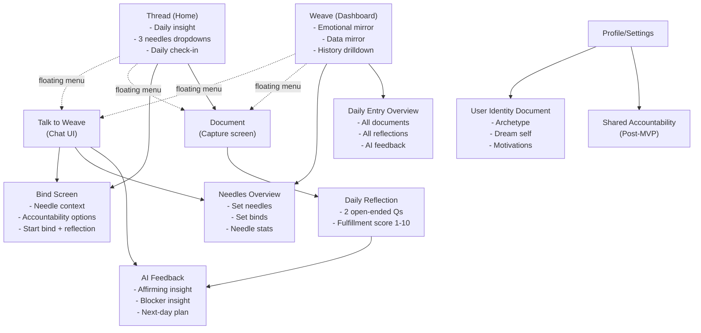
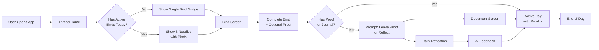

# Weave UX/UI Architecture

## Table of Contents

1. [Design Changelog](#design-changelog) ⭐ NEW
2. [Architecture Overview](#architecture-overview)
3. [System Diagrams](#system-diagrams)
   - [Flowchart: UX Navigation Model](#flowchart-ux-navigation-model)
   - [Flowchart: Core User Loop](#flowchart-core-user-loop)
4. [Architecture Description](#architecture-description)
5. [Product Intent & North Star](#product-intent--north-star)
6. [Navigation Model](#navigation-model)
7. [Screen Specifications](#screen-specifications)
8. [User Flow Patterns](#user-flow-patterns)
9. [Design System](#design-system)
10. [UX Principles](#ux-principles)
11. [Architecture Decisions](#architecture-decisions)

---

## Design Changelog

*Track all UX/UI design changes with version numbers, dates, rationale, and impacted areas.*

### v2 - 2025-12-17 - Home Screen & Navigation Redesign

**Changes Made:**

1. **Calendar Component Added to Home Screen** `[v1.1]`
   - Added calendar view for daily check-in visibility
   - Shows at-a-glance completion status for the week/month
   - Replaces scrolling through history for recent activity

2. **Streak System Enhanced with Recovery Mechanism** `[v1.1]`
   - **Old:** Streak resets to 0 on any missed day
   - **New:** 3 consecutive check-ins after missing a day prevents streak loss
   - Shows "streak resilience" metric instead of harsh resets
   - Reduces anxiety about missing a single day

3. **Navigation Architecture Changed** `[v1.1]`
   - **Old:** Floating button for Weave chat access
   - **New:** Weave chat moved to navigation bar item
   - Simplifies UI by removing floating button complexity
   - Makes chat more discoverable as primary feature

4. **Document System Refined** `[v1.1]`
   - Daily documentation requires 3-item minimum for weave level-up
   - Progress tracking shows "2 out of 3" completion status
   - Accepts: pictures, notes, videos, voice memos
   - Not tied to specific binds - general life recording
   - No maximum limit but rewards cap at 3 items

5. **Bind Workflow Updated** `[v1.1]`
   - Post-action flow: Complete → Optional reflection → Confetti → Insight
   - Insight provided regardless of reflection completion
   - Immediate insight if reflection completed
   - Accountability measure includes "strengthening your weave" incentive

6. **Daily Check-in Process Enhanced** `[v1.1]`
   - 24-hour countdown timer for end-of-day task
   - Recap feature shows daily documents + bind completion
   - Swipeable interface through day's activities
   - Includes all documented items plus completed binds

7. **Weave Chat Repositioned** `[v1.1]`
   - Chat serves as content engine and entertainment tool
   - Animated speaking effect as text appears
   - Replaces traditional social media feeds for engagement
   - Accessible from navigation bar, not floating button

**Rationale:**

- **Calendar visibility:** Users need quick check-in history without navigation
- **Streak recovery:** Prevents shame spirals, encourages comeback behavior
- **Navigation simplification:** Reduces UI complexity, makes chat discoverable
- **Document minimum:** Creates clear daily goal (3 items) for progression
- **Enhanced workflow:** Better accountability and immediate feedback loop

**Impacted Screens:**

- Thread (Home) - Calendar + 3 needles overview
- Navigation Bar - Added Weave chat item, removed floating button
- Bind Screen - Updated post-completion flow
- Document Screen - Progress tracking (X out of 3)
- Daily Check-in - Recap + swipeable interface
- Weave Dashboard - Streak resilience display

**Impacted Stories:**

- **Epic 1:** Onboarding & Identity (1.6 - goal breakdown may need calendar context)
- **Epic 3:** Daily Actions
  - 3.1: View Today's Binds (calendar integration)
  - 3.3: Complete Bind (new post-action flow)
  - 3.5: Quick Note Capture (document system changes)
- **Epic 4:** Reflection & Journaling
  - 4.1: Daily Reflection Entry (check-in flow updates)
  - 4.2: Recap Before Reflection (swipeable recap)
- **Epic 5:** Progress Dashboard
  - 5.5: Streak Display (recovery mechanism)
  - 5.1: Dashboard Overview (calendar component)
- **Epic 6:** AI Coaching
  - 6.1: Access AI Chat (navigation bar placement)

**Implementation Notes:**

- Calendar component needs read access to `daily_aggregates` table
- Streak recovery logic requires updating streak calculation algorithm
- Navigation bar needs design update in design system
- Document progress tracking needs real-time counter component
- Check-in recap needs swipeable carousel component

---

### v1 - 2025-12-16 - Initial UX Architecture `[MVP]`

**Initial Design:**
- Two-screen navigation (Thread + Weave) `[MVP]`
- Floating menu for secondary actions `[MVP]`
- Basic streak system (reset on miss) `[MVP]`
- Document screen without minimum requirements `[MVP]`
- Standard bind completion flow `[MVP]`

**Reference:** Original architecture decisions in sections below represent MVP baseline

---

## Architecture Overview

**Platform:** React Native mobile app (iOS App Store)

**UX Philosophy:** Weave turns vague goals into daily wins, proof, and identity reinforcement. The UX must constantly shepherd users into: (1) doing a bind (action), and (2) leaving proof (capture) or reflecting (check-in).

**Core Design Principles:**
- **North Star Focus** - Every screen optimizes for "Active Days with Proof"
- **Minimal Friction** - Complete a bind in <30 seconds, document in <10 seconds
- **Trust-Based** - No complex verification; rely on user honesty
- **Cost-Conscious** - Most screens don't call AI models; batch around journal time
- **Deterministic Personality** - AI feels consistent, not random
- **Editable by Default** - All AI outputs can be user-modified

**Key Constraint:** The UX must answer "What should I do today?" and "Did I do it?" in under 10 seconds.

---

## System Diagrams

### Flowchart: UX Navigation Model

### Flowchart: Core User Loop

---

## Architecture Description

### The Big Idea

Weave's UX is built around two primary screens that serve distinct purposes:

1. **Thread (Home)** - Execution surface: "What should I do today?" + "Did I do it?"
2. **Weave (Dashboard)** - Mirror surface: Identity + progress + drilldown

Both screens share a floating menu button for quick access to:
- **Talk to Weave** - Chat interface for coaching and clarification
- **Document** - Fast capture of proof and memories

### Why This Architecture

**For MVP Goals:**
1. **Shepherds North Star** - Every screen optimizes for "Active Days with Proof"
2. **Minimal Cognitive Load** - Two primary screens, clear hierarchy
3. **Fast Execution** - Complete bind in <30 seconds, document in <10 seconds
4. **Cost-Efficient** - Most screens read from database, don't call AI models

**For User Trust:**
1. **Transparent** - All AI outputs editable, no black boxes
2. **Consistent** - Same personality, same style, every day
3. **Grounded** - References actual user data, not generic advice

---

## Product Intent & North Star

### North Star Metric

**Active Days with Proof** = User completes at least 1 subtask (bind) + logs either:
- (a) A memory/capture, OR
- (b) A journal check-in

### UX Implications

Every screen must answer:
1. **"What should I do today?"** - Show next smallest win (one bind)
2. **"Did I do it?"** - Make completion + proof frictionless
3. **"How am I doing?"** - Show progress without judgment

### Core User Loop (From MVP)

The user has goals (needles) they are reminded and convicted of doing, with known habits/actions (binds) that they must complete to make progress. Every day, the user:
1. Documents their day (actions taken, as reminded by AI)
2. Reflects on what they've done and what they want to do tomorrow
3. Receives AI feedback and next-day plan

At any point, the user can see their progress in the dashboard, where logged actions impact their digital avatar and contribute to getting closer to their dream outcome.

---

## Navigation Model

**Version:** v2 (Updated 2025-12-17)

### Primary Tabs (MVP)

**Three main navigation items:**

1. **Thread (Home)**
   - Today's plan + daily check-in
   - Quick entry into binds and documenting
   - Primary execution surface
   - Calendar component for activity visibility

2. **Weave Chat** ⭐ MOVED TO NAV BAR (v2)
   - **Changed:** Previously floating button, now navigation bar item
   - Chat interface for coaching and clarification
   - Content engine and entertainment tool
   - Animated speaking effect as text appears
   - Replaces traditional social media feeds for engagement
   - More discoverable as primary feature

3. **Weave (Dashboard)**
   - Emotional mirror (identity + progress)
   - Data mirror (consistency + fulfillment charts)
   - History drilldown

### Navigation Architecture Change (v2)

**Old (v1):**
- Two-tab navigation (Thread + Weave)
- Floating menu button for Talk to Weave and Document

**New (v2):**
- Three-item navigation bar (Thread + Weave Chat + Weave Dashboard)
- **Removed:** Floating menu button
- **Document** access moved to Thread screen action buttons
- **Rationale:** Simplifies UI, makes chat more discoverable, reduces clutter

### Secondary Screens

- **Bind Screen** - Action + proof interface
- **Daily Reflection** - Check-in with fulfillment score
- **AI Feedback** - Insights and next-day plan
- **Needles Overview** - Goal management
- **Daily Entry Overview** - History drilldown
- **Profile/Settings** - Preferences and identity
- **User Identity Document** - Personal model for AI

---

## Screen Specifications

### 1. Thread (Home)

**Version:** v2 (Updated 2025-12-17)

**Job:** "What should I do today?" + "Did I do it?" in under 10 seconds. This is the execution surface.

**Information Architecture:**

**Top Bar:**
- Weave level + quick identity cue (tiny, not preachy)
- Profile button (leads to Profile/Settings)
- Compact "yesterday insight / daily intention summary" (also used for notification copy)

**Calendar Component (NEW in v2):**
- Week/month view showing daily check-in completion status
- At-a-glance visibility of recent activity patterns
- Visual indicator: completed days vs. missed days
- Tap on date to view that day's details
- Shows streak resilience (3-day recovery) visually

**Streak Counter (ENHANCED in v2):**
- Displays consecutive daily check-in days with weave symbol
- **Recovery Mechanism:** 3 consecutive check-ins after missing a day prevents streak loss
- Shows "streak resilience" metric instead of harsh resets
- Visual: progress bar or counter showing recovery progress if applicable
- Reduces anxiety messaging ("You're 2/3 days to recovering your streak!")

**Middle: "3 Needles" Dropdown Stack**
- Each needle expands to show its binds for today
- Empty checkbox cards that open the Bind Screen
- Visual affordance: "Opal-like" elegant expansion, feels like "unfolding thread"
- May increase size or use symbols instead of text (design decision pending)

**Two Main Action Buttons:**
- **Thread Document:** Access identity document and daily documentation
- **Daily Check-in:** Primary CTA for end-of-day reflection flow
- Copy explicitly connects to North Star: "log moments + reflect with Weave"
- Tap takes user into Document → Recap → Reflection → AI Feedback flow

**Key UX Behaviors:**
- Always show "next smallest win" (one bind) and a "leave proof" option (capture)
- If user has done nothing yet today, Thread should nudge a single bind, not the whole system
- Micro-interaction: expanding a needle should feel like "unfolding thread"

**UI Notes:**
- Very clean cards, lots of whitespace, soft glass panels
- Needle dropdown affordance should feel elegant, not busy
- Minimal visual noise

**Data Requirements (From Backend):**
- Reads from `triad_tasks` for today's plan
- Reads from `subtask_instances` for today's binds
- Reads from `daily_aggregates` for today's status
- Reads from `ai_artifacts` for yesterday's insight (cached, no model call)

---

### 2. Talk to Weave (Chat)

**Job:** Quick coaching, quick clarification, zero rabbit holes.

**Flow:**
- Chat screen first shows Weave's message, then gives the user a response box
- Guided prompt style, not a blank chat every time

**MVP Guardrails:**
- Deterministic personality (from `identity_docs`)
- Editable outputs (all responses can be corrected)
- Cost control: don't call model on every screen; batch around journal time

**Practical UX Implication:** Chat should be optional and purposeful, not the "main UI"

**UI Notes:**
- Chat bubbles should be calm, minimal, with subtle "dream self" signature
- Quick chips: "Plan my day", "I'm stuck", "Explain this bind", "Edit my goal"
- Streaming response for better perceived latency

**Data Requirements (From Backend):**
- Reads from `identity_docs` for personality
- Reads from `goals`, `subtask_instances`, `journal_entries` for context
- Calls AI module `dream_self` (async, rate-limited to 10/hour)

---

### 3. Bind Screen (Action + Proof)

**Version:** v2 (Updated 2025-12-17)

**Job:** "Do the thing" moment. This is where users complete binds and leave proof.

**Must-Have Content:**
- **Needle Context:** Why, start state, dream state (small, skimmable)
- **Workout Completion Status by Day:** Shows which days bind was completed
- **Accountability Measure:** "Strengthening your weave" incentive messaging (NEW in v2)
- **Accountability Options:** Photo, timer, gallery upload
- **Start Bind Button:** Primary action
- **Optional Reflection Prompt:** 1 question max

**Post-Action Flow (UPDATED in v2):**
1. Complete the action
2. Optional reflection (triggers immediate insight if completed)
3. Confetti celebration (short, classy)
4. **Insight provided regardless of reflection completion** (NEW in v2)
   - If reflection completed: immediate insight
   - If skipped: insight still provided after completion

**Success Criteria:**
- Completing a bind should take <30 seconds to log if user wants "trust-based proof"
- Insight delivery within 5 seconds of completion

**UI Notes:**
- One primary action. Everything else is secondary
- Timer UX: one tap start, one tap stop, with auto-suggested "attach proof" at end
- Photo capture: one tap to camera, one tap to attach

**Data Requirements (From Backend):**
- Reads from `goals` for needle context
- Reads from `subtask_instances` for bind details
- Writes to `subtask_completions` (immutable event log)
- Writes to `captures` for proof
- Writes to `subtask_proofs` to link proof to completion
- Triggers `event_log` entry: `subtask_completed`

---

### 4. Document (Daily Media to Remember)

**Version:** v2 (Updated 2025-12-17)

**Job:** Capture proof and memories with almost no friction. Daily documentation for weave progression.

**MVP Requirements (ENHANCED in v2):**
- **3-item minimum for weave level-up** (NEW in v2)
- Progress tracking shows "X out of 3" completion status
- Accepts: pictures, notes, videos, voice memos
- **Not tied to specific binds** - general life recording
- **No maximum limit** but rewards cap at 3 items
- Provides insights/comments after uploads
- If there's nothing yet, UI should prompt: "what's one thing you want to remember today?"

**Progress Tracking (NEW in v2):**
- Real-time counter: "2 out of 3 documented today"
- Visual progress bar or indicator
- Clear messaging: "1 more to strengthen your weave today!"
- After 3 items: "Daily goal reached! Keep documenting if you'd like."

**UI Notes:**
- Think "fast capture sheet" more than "notes app"
- Default input should be voice-first available (later), but MVP can be text + photo
- Minimal fields: type (text/photo/audio/video), content, optional link to bind
- Progress indicator always visible
- Quick action buttons for each media type

**Data Requirements (From Backend):**
- Writes to `captures` table
- Links to `subtask_instances` via `subtask_proofs` if proof
- Triggers `event_log` entry: `capture_created`
- Updates `daily_aggregates.has_proof` = true

---

### 5. Daily Reflection & Check-in

**Version:** v2 (Updated 2025-12-17)

**Job:** Turn the day into signal: what worked, what didn't, and a fulfillment score.

**Check-in Flow (ENHANCED in v2):**
1. **24-Hour Countdown Timer** (NEW in v2)
   - End-of-day task timer visible on home screen
   - Encourages completion before day resets

2. **Recap Feature** (NEW in v2)
   - Shows daily documents uploaded
   - Shows bind completion status
   - **Swipeable interface** through day's activities
   - Includes all documented items plus completed binds
   - Visual timeline of the day's progress

3. **Reflection Questions**
   - Two open-ended questions + rate fulfillment 1-10
   - Questions: "How do you feel about today? (What worked well and didn't?)" + "What is the one thing you want to get done for tomorrow?"

**Spec Alignment:**
- Reflection is explicitly "two open-ended questions + rate fulfillment 1-10"
- MVP calls out fulfillment score intake
- **Recap before reflection** ensures user reviews their day first

**UI Notes:**
- Swipeable carousel for recap (horizontal scrolling)
- One screen for reflection, no scrolling if possible
- Slider for 1-10, and two short text fields (with "skip" allowed, but not encouraged)
- Countdown timer shows "X hours until check-in resets"

**Data Requirements (From Backend):**
- Writes to `journal_entries` table
- Triggers async batch job:
  1. Generate tomorrow's triad (AI module `triad`)
  2. Generate daily recap (AI module `recap`)
  3. Compute updated stats
- Triggers `event_log` entry: `journal_submitted`
- Updates `daily_aggregates.has_journal` = true

---

### 6. AI Feedback

**Job:** Reinforce identity, diagnose blocker, propose next-day plan, and let the user correct it.

**MVP Content:**
- **Affirming Insight:** Positive pattern or progress
- **Blocker Insight:** Addresses what's blocking the user
- **Next-Day Plan Summary:** Tomorrow's triad tasks

**Key Principles:**
- AI is a coach, not a god: "no hallucinated certainty" + user can clarify/correct
- All outputs editable

**UI Notes:**
- Render as 3 stacked cards (Affirmation, Blocker, Tomorrow)
- Each card has "Edit" and "Not true" actions (enforces trust and deterministic personalization)
- User can correct AI assumptions

**Data Requirements (From Backend):**
- Reads from `ai_artifacts` (type: `recap`)
- Links to `ai_runs` for traceability
- User edits tracked in `user_edits` table
- Can regenerate if user corrects assumptions

---

### 7. Weave (Dashboard)

**Job:** "Mirror" screen: identity + progress + drilldown.

**MVP Definition:**

**Top: Emotional Mirror**
- Weave level (rank/level visualization)
- Needles (active goals)
- Anchor (starting point)
- Dream outcome (future state)

**Bottom: Data Mirror**
- Consistency % heat map (filter by timeframe: overall, needle, bind type)
- Average fulfillment chart (filter by timeframe)
- AI insights underneath (potentially conversational)
- Drag across chart to pick out a certain date and explore that day's entries

**Recovery System:**
- "Three days in a row" can recover missed consistency percentage
- Shows "streak resilience" metric, not just streak resets (prevents shame spirals)

**Visualization Philosophy:**
- Gradient heat map intensity shows partial completion, not binary
- Moving averages smooth volatility (avoid fake weekly resets)
- Rolling 7-day average vs weekly resets

**UI Notes:**
- This is where "Opal inspiration" belongs: beautiful progression artifact (thread -> weave) that feels earned, but not childish
- Character weave (personified representation) shows progression
- Heat map replaces calendar view
- Color intensity shows completion percentage (not just binary)

**Data Requirements (From Backend):**
- Reads from `user_stats` for overall metrics
- Reads from `daily_aggregates` for heat map data
- Reads from `goals` for active needles
- Reads from `identity_docs` for dream self
- Reads from `ai_artifacts` (type: `insight`) for AI insights
- No model calls on this screen (all pre-computed)

---

### 8. Needles Overview (Goal Management)

**Job:** Define and adjust the goal tree without inviting overcommitment.

**MVP Constraints:**
- Needles max = 3 goals at a time
- Setting goals includes "why it matters", start state, dream outcome, and binds

**UI Notes:**
- Treat this as "setup and tune", not something users live in daily
- Use progressive disclosure: show only 1 goal in detail at a time
- Goal change strictness modes: Normal (justification), Strict (daily reflection), None (no changes)

**Data Requirements (From Backend):**
- Reads/writes to `goals` table
- Reads/writes to `qgoals` table
- Reads/writes to `subtask_templates` table
- Enforces max 3 active goals constraint
- AI module `onboarding` generates initial goal structure

---

### 9. Daily Entry Overview (History Drilldown)

**Job:** One place to see everything that happened that day: documents, reflection, AI feedback, plus follow-up convo.

**MVP Direction:**
- History/log page with search and filtering as a power feature
- Timeline layout: Proof (binds) -> Captures -> Reflection -> AI Feedback

**UI Notes:**
- Search is optional MVP, but a date filter is cheap and valuable
- Sort by timeframe (days, weeks, months) and medium (reflection, bind, photo, etc.)

**Data Requirements (From Backend):**
- Reads from `subtask_completions` for bind completions
- Reads from `captures` for proof and memories
- Reads from `journal_entries` for reflections
- Reads from `ai_artifacts` for AI feedback
- All filtered by `local_date` (user's timezone)

---

### 10. Profile/Settings

**Job:** Adjust nudging strictness, goal change strictness, data export, delete account.

**From MVP Spec:**
- Nudging slider (how much AI should proactively reach out)
- Goal change strictness modes
- Data export (simple JSON later)
- Delete account (trust)

**UI Notes:**
- Keep it "futuristic settings", but do not reinvent settings UX
- Familiar is good here
- General settings: Name, username, email, phone number
- App settings: Nudging slider, strictness modes, export, delete

**Data Requirements (From Backend):**
- Reads/writes to `user_profiles` table
- Settings stored in user preferences (JSONB field)

---

### 11. User Identity Document

**Job:** Stable personal model for the AI, user-editable.

**Spec Content:**
- Archetype (MBTI-like but not cringe)
- Dream self paragraph
- Motivations (2-3)
- Constraints (time windows, energy patterns, obligations)
- Coaching preference slider (gentle ↔ strict)
- Failure mode (one selection: procrastination, overcommitment, avoidance, perfectionism)

**UI Notes:**
- Make it feel like a "profile for your future self," not a psych test
- Everything is editable, with version history later
- Versioned to allow rollback

**Data Requirements (From Backend):**
- Reads/writes to `identity_docs` table (versioned)
- AI modules reference specific version for deterministic personality
- User edits tracked for audit trail

---

### 12. Shared Accountability (Post-MVP)

**Job:** Stub in settings for future social features.

**Spec Says It's Post-MVP:**
- Pair with friends on similar goals
- Auto notify on completion
- Shareable profile pages

**UI Notes:**
- Treat as a stub in settings for now
- Don't build this in MVP

---

## User Flow Patterns

### Pattern A: Morning Routine (Fast Path)

**User Journey:** Open app → See today's plan → Complete first bind

**Flow:**
1. User opens Thread (Home)
2. Sees yesterday's insight + today's triad tasks
3. Expands first needle, sees binds for today
4. Taps empty checkbox → Opens Bind Screen
5. Taps "Start Bind" → Completes action
6. Optional: Attach photo proof
7. Confetti (short, classy)
8. Returns to Thread

**Time Target:** <30 seconds from open to completion

**Data Flow:**
- Reads `triad_tasks` (cached, no model call)
- Reads `subtask_instances` for today
- Writes `subtask_completions` (immutable event)
- Updates `daily_aggregates` (async worker)

---

### Pattern B: Evening Reflection (AI-Heavy Path)

**User Journey:** End of day → Document → Reflect → Get feedback

**Flow:**
1. User taps "Daily Check-in" CTA on Thread
2. Opens Document screen
3. Adds captures (photos, notes, voice)
4. Taps "Reflect" → Opens Daily Reflection
5. Answers 2 questions + rates fulfillment 1-10
6. Submits → Triggers async batch:
   - Generate tomorrow's triad
   - Generate daily recap
   - Compute stats
7. Shows loading state: "Weave is reflecting..."
8. Push notification when ready: "Your plan for tomorrow is ready"
9. User opens → Sees AI Feedback screen
10. Can edit/correct AI insights

**Time Target:** Reflection submission <2 minutes, AI processing 20 seconds

**Data Flow:**
- Writes `captures` (if any)
- Writes `journal_entries`
- Triggers `event_log.journal_submitted`
- Queue batch job:
  - AI module `triad` → Writes `triad_tasks`
  - AI module `recap` → Writes `ai_artifacts`
  - Worker updates `daily_aggregates` and `user_stats`
- Push notification via `devices` table

---

### Pattern C: Recovery Loop (48h Inactivity)

**User Journey:** User hasn't opened app in 48 hours → Recovery mission

**Flow:**
1. User opens app after 48h inactivity
2. Thread shows: "Welcome back. Take a 10-minute win."
3. Offers Recovery Mission (ultra small, low friction)
4. Shows "streak resilience" metric, not just streak resets
5. User completes recovery mission
6. Can recover missed habits/consistency by getting three days in a row

**UI Notes:**
- Compassionate, not shame-based
- Reference specific goals and past wins
- Offer easy re-entry point

**Data Requirements:**
- Reads `user_stats.last_active_at`
- Reads `daily_aggregates` for streak calculation
- Recovery mission is a special `subtask_instance` with `difficulty = 1`

---

### Pattern D: Ad-Hoc Chat

**User Journey:** User needs clarification or coaching

**Flow:**
1. User taps floating menu → "Talk to Weave"
2. Chat screen shows Weave's message (contextual prompt)
3. User types or uses quick chips
4. Preprocessing normalizes input (voice → text, etc.)
5. Safety validation
6. Orchestrator builds context
7. LLM generates response in Dream Self voice
8. Streaming response to user
9. User can correct/clarify

**Time Target:** Response within 5-10 seconds

**Data Flow:**
- Reads `identity_docs` for personality
- Reads `goals`, `subtask_instances`, `journal_entries` for context
- Calls AI module `dream_self` (rate-limited to 10/hour)
- Writes `ai_runs` and `ai_artifacts` for traceability

---

## Design System

### Aesthetic: Futuristic Minimal Productivity

**Visual Language:**
- Calm, high-end, "glass + whitespace"
- Not sci-fi clutter
- Think Opal app + Duolingo aesthetic (middle ground)

**Color Palette:**
- Primary: Soft, muted tones
- Accent: Subtle highlights for actions
- Background: Clean whites/light grays
- Text: High contrast for readability

**Typography:**
- 2 sizes max per screen (title + body)
- Avoid visual noise
- Clear hierarchy

**Components:**
- Card stacks (soft glass panels)
- Dropdown needles (elegant expansion)
- One-tap capture buttons
- One-tap bind start
- Minimal form inputs

**Motion:**
- Tiny, purposeful animations
- Expand needle (feels like "unfolding thread")
- Completion pulse (subtle)
- Short confetti (classy, not childish)
- No excessive motion

**Spacing:**
- Lots of whitespace
- Generous padding
- Clear visual separation between sections

---

## UX Principles

### 1. North Star Focus

**Principle:** Every screen optimizes for "Active Days with Proof"

**Implementation:**
- Thread always shows "next smallest win" (one bind)
- Always offers "leave proof" option (capture)
- Daily check-in CTA explicitly connects to North Star
- Recovery loop offers easy re-entry

---

### 2. Minimal Friction

**Principle:** Complete a bind in <30 seconds, document in <10 seconds

**Implementation:**
- One-tap actions where possible
- Minimal form fields
- Trust-based proof (no complex verification)
- Fast capture sheet (not full notes app)

---

### 3. Cost-Conscious UX

**Principle:** Most screens don't call AI models; batch around journal time

**Implementation:**
- Thread reads cached `triad_tasks` (no model call)
- Dashboard reads pre-computed `daily_aggregates` (no model call)
- Chat is optional and purposeful (rate-limited)
- AI Feedback shown after async batch completes

**UX Implication:** Users see loading states for AI operations, but most screens are instant

---

### 4. Trust-Based Design

**Principle:** Rely on user honesty rather than complex verification

**Implementation:**
- Simple photo/timer proof options
- No complex verification flows
- User can edit AI outputs
- Transparent about what AI knows vs. assumes

---

### 5. Deterministic Personality

**Principle:** AI feels consistent, not random

**Implementation:**
- Same personality every day (from `identity_docs`)
- References actual user data (past wins, current goals)
- Editable outputs (user can correct)
- No hallucinated certainty

---

### 6. Editable by Default

**Principle:** All AI outputs can be user-modified

**Implementation:**
- Every AI output has "Edit" action
- User can mark insights as "Not true"
- Corrections trigger regeneration if needed
- Edit history tracked for audit

---

### 7. Progressive Disclosure

**Principle:** Show only what's needed, when it's needed

**Implementation:**
- Needles collapse by default, expand on tap
- Needles Overview shows 1 goal in detail at a time
- Settings use familiar patterns (don't reinvent)
- History page is power feature (not primary navigation)

---

### 8. Recovery-Focused

**Principle:** Streaks are built on comebacks, not perfection

**Implementation:**
- Show "streak resilience" metric, not just resets
- Recovery missions are ultra small, low friction
- Three days in a row can recover missed consistency
- Compassionate messaging, not shame-based

---

## Architecture Decisions

### Critical Decisions This UX Forces

#### 1. Two-Screen Navigation Model

**Decision Required:** Why only two primary screens?

**Rationale:**
- Thread = Execution (what to do, did I do it?)
- Weave = Reflection (how am I doing, who am I becoming?)
- Clear mental model: action vs. reflection
- Prevents navigation sprawl

**Alternative Considered:** More screens (separate goals, history, etc.)
- **Rejected:** Too many screens = cognitive load
- **Chosen:** Two screens + floating menu for quick actions

---

#### 2. Floating Menu vs. Bottom Tab Bar

**Decision Required:** How to access secondary actions?

**Rationale:**
- Floating menu keeps primary screens clean
- "Talk to Weave" and "Document" are secondary actions
- Not part of daily core loop (Thread → Bind → Document → Reflect)

**Alternative Considered:** Bottom tab bar with 4-5 tabs
- **Rejected:** Too many tabs = decision fatigue
- **Chosen:** Two primary tabs + floating menu

---

#### 3. Bind Completion Flow

**Decision Required:** How to make bind completion <30 seconds?

**Rationale:**
- One primary action: "Start Bind"
- Proof is optional (trust-based)
- Timer: one tap start, one tap stop
- Photo: one tap to camera, one tap to attach

**Alternative Considered:** Complex verification flows
- **Rejected:** Too much friction, violates trust-based principle
- **Chosen:** Simple, fast, trust-based

---

#### 4. AI Feedback Timing

**Decision Required:** When to show AI feedback?

**Rationale:**
- After journal submission (evening reflection)
- Async batch job (20 seconds processing)
- Push notification when ready
- User can view immediately or later

**Alternative Considered:** Show immediately after reflection
- **Rejected:** Would require blocking UI for 20 seconds
- **Chosen:** Async with notification

---

#### 5. Dashboard Visualization

**Decision Required:** Calendar view vs. heat map?

**Rationale:**
- Heat map with gradient intensity shows partial completion
- Moving averages smooth volatility
- More accurate than binary calendar view
- Opal-inspired aesthetic

**Alternative Considered:** Traditional calendar with checkmarks
- **Rejected:** Binary (done/not done) doesn't show partial progress
- **Chosen:** Gradient heat map with intensity

---

#### 6. Chat Interface Style

**Decision Required:** Guided prompts vs. blank chat?

**Rationale:**
- Chat screen first shows Weave's message (contextual prompt)
- Then gives user response box
- Guided style prevents rabbit holes
- Quick chips for common actions

**Alternative Considered:** Blank chat interface (like ChatGPT)
- **Rejected:** Too open-ended, violates "zero rabbit holes" principle
- **Chosen:** Guided prompts with quick chips

---

#### 7. Recovery Loop Design

**Decision Required:** How to handle 48h inactivity?

**Rationale:**
- Show "Welcome back. Take a 10-minute win."
- Offer Recovery Mission (ultra small, low friction)
- Show "streak resilience" metric, not just resets
- Three days in a row can recover missed consistency

**Alternative Considered:** Reset streak, show shame message
- **Rejected:** Shame spirals hurt retention
- **Chosen:** Compassionate recovery with resilience metric

---

## MVP Scope

### Must Ship for V1

**Core Screens:**
- ✅ Thread (Home) - Execution surface
- ✅ Weave (Dashboard) - Mirror surface
- ✅ Bind Screen - Action + proof
- ✅ Document - Fast capture
- ✅ Daily Reflection - Check-in
- ✅ AI Feedback - Insights and plan
- ✅ Talk to Weave - Chat interface
- ✅ Needles Overview - Goal management
- ✅ Profile/Settings - Preferences

**Design System:**
- ✅ Color palette and typography
- ✅ Component library (cards, buttons, inputs)
- ✅ Motion guidelines
- ✅ Spacing system

**User Flows:**
- ✅ Morning routine (fast path)
- ✅ Evening reflection (AI-heavy path)
- ✅ Recovery loop (48h inactivity)
- ✅ Ad-hoc chat

### Add Later (V1.5+)

**Enhanced Features:**
- Voice-first input (TTS for notifications)
- Advanced history search and filtering
- Shared accountability (social features)
- Custom weave visualizations
- iMessage integration

**Design Enhancements:**
- Custom animations
- Advanced heat map interactions
- Multi-modal capture (video, etc.)

---

## Alignment with MVP Features

### How UX Supports Each Must-Ship Feature

**1. Goal Breakdown Engine**
- **UX Surface:** Needles Overview screen
- **How:** User sets goals, AI breaks down into Q-goals and binds
- **Flow:** Onboarding → Goal input → AI breakdown → User edits

**2. Identity Document**
- **UX Surface:** Profile/Settings → Identity Document
- **How:** User defines archetype, dream self, motivations
- **Flow:** Onboarding → Identity discovery → Editable profile

**3. Action + Memory Capture**
- **UX Surface:** Bind Screen + Document screen
- **How:** Complete bind + attach proof, or capture memories
- **Flow:** Thread → Bind Screen → Complete + Proof → Document

**4. Daily Reflection**
- **UX Surface:** Daily Reflection screen
- **How:** Two questions + fulfillment score
- **Flow:** Thread → Daily Check-in → Document → Reflection → AI Feedback

**5. Progress Visualization**
- **UX Surface:** Weave Dashboard
- **How:** Heat map, consistency %, fulfillment chart
- **Flow:** Weave tab → See progress → Drill down to daily entries

**6. AI Coach**
- **UX Surface:** Talk to Weave chat interface
- **How:** Dream Self personality, references identity + history
- **Flow:** Floating menu → Chat → Get coaching → Edit if needed

---

## Next Steps

### Before Implementation

1. **Create Design System** - Color palette, typography, components
2. **Build Component Library** - Cards, buttons, inputs, dropdowns
3. **Design Screen Mockups** - Thread, Weave, Bind, Document, Reflection
4. **Define Motion Specs** - Animations, transitions, micro-interactions
5. **Write Interaction Specs** - Tap targets, gestures, feedback

### During MVP Development

1. **Build Thread First** - Primary execution surface
2. **Implement Bind Flow** - Core action loop
3. **Add Dashboard** - Progress visualization
4. **Integrate Chat** - Dream Self advisor
5. **Test with Real Users** - Ensure <30s bind completion

### Post-MVP

1. **A/B Test Recovery Loop** - Find optimal messaging
2. **Measure North Star** - Track "Active Days with Proof"
3. **Optimize Friction** - Reduce time to complete bind
4. **Enhance Visualizations** - Improve heat map and charts

---

*Last Updated: UX/UI Architecture Planning Phase*

