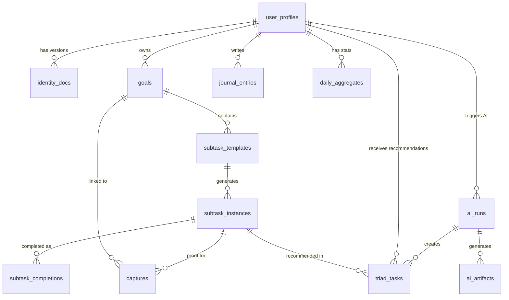

# Database Schema

**Created:** 2025-12-18
**Stories:** 0.2a (Core Tables) + 0.2b (Critical Tables + Optimization)
**Status:** ✅ Migrations 001-013 Complete
**Database:** Supabase PostgreSQL 15

---

## Overview

Weave uses **13 tables** organized into 3 functional layers:

1. **User & Identity Layer** (2 tables): user_profiles, identity_docs
2. **Goal & Task Layer** (5 tables): goals, subtask_templates, subtask_instances, subtask_completions, triad_tasks
3. **Content & AI Layer** (6 tables): captures, journal_entries, daily_aggregates, ai_runs, ai_artifacts

---

## Entity Relationship Diagram

---

## Table Catalog

### 1. user_profiles (User Identity)

**Purpose:** Store user profile information linked to Supabase Auth

| Column | Type | Constraints | Description |
|--------|------|-------------|-------------|
| id | UUID | PK, DEFAULT gen_random_uuid() | Internal user ID |
| auth_user_id | TEXT | UNIQUE, NOT NULL | Links to Supabase auth.users.id |
| display_name | TEXT | | User's display name |
| timezone | TEXT | **NOT NULL** | IANA timezone (e.g., America/Los_Angeles) - **CRITICAL** |
| locale | TEXT | DEFAULT 'en-US' | User's locale preference |
| created_at | TIMESTAMPTZ | DEFAULT NOW() | Account creation timestamp |
| updated_at | TIMESTAMPTZ | DEFAULT NOW() | Last profile update |
| last_active_at | TIMESTAMPTZ | | Last app interaction (for return states UX-R) |

**Indexes:**
- `idx_user_profiles_auth_id` ON (auth_user_id)

**Critical Notes:**
- ⚠️ **timezone is NOT NULL** - Required for all local_date calculations
- Used for Return States (UX-R): Triggers compassionate re-engagement after 48h inactivity

---

### 2. identity_docs (Versioned Identity Document)

**Purpose:** Store versioned identity documents (archetype, dream self, motivations, constraints)

| Column | Type | Constraints | Description |
|--------|------|-------------|-------------|
| id | UUID | PK, DEFAULT gen_random_uuid() | Document ID |
| user_id | UUID | NOT NULL, FK → user_profiles(id) ON DELETE CASCADE | Owner |
| version | INT | NOT NULL, DEFAULT 1, CHECK (version >= 1) | Version number (auto-increment) |
| json | JSONB | NOT NULL | Identity data: {archetype, dream_self, motivations[], failure_mode, constraints, coaching_preference} |
| created_at | TIMESTAMPTZ | DEFAULT NOW() | Version creation timestamp |
| | | UNIQUE(user_id, version) | One version per number per user |

**Indexes:**
- `idx_identity_docs_user_version` ON (user_id, version DESC)

**Critical Notes:**
- Append-only versioning: Each edit creates new version
- Query latest: `ORDER BY version DESC LIMIT 1`
- AI uses latest version for personalization

---

### 3. goals (User Goals / Needles)

**Purpose:** Store user goals (called "Needles" in UI) with max 3 active constraint

| Column | Type | Constraints | Description |
|--------|------|-------------|-------------|
| id | UUID | PK, DEFAULT gen_random_uuid() | Goal ID |
| user_id | UUID | NOT NULL, FK → user_profiles(id) ON DELETE CASCADE | Owner |
| title | TEXT | NOT NULL | Goal title |
| description | TEXT | | Goal description |
| status | goal_status | DEFAULT 'active' | Enum: active, paused, completed, archived |
| priority | goal_priority | DEFAULT 'med' | Enum: low, med, high |
| start_date | DATE | | Optional start date |
| target_date | DATE | | Optional target date |
| created_at | TIMESTAMPTZ | DEFAULT NOW() | |
| updated_at | TIMESTAMPTZ | DEFAULT NOW() | |
| | | CHECK (start_date <= target_date) | Start must be before target |

**Indexes:**
- `idx_goals_user_status` ON (user_id, status)
- `idx_goals_user_created` ON (user_id, created_at DESC)
- `idx_goals_user_status_created` ON (user_id, status, created_at DESC) WHERE status = 'active'

**Triggers:**
- ⚠️ **enforce_max_active_goals** - Prevents >3 active goals per user

**Critical Notes:**
- Max 3 active goals enforced via trigger function `check_max_active_goals()`
- Error message: "User can have maximum 3 active goals. Archive or complete an existing goal first."

---

### 4. subtask_templates (Reusable Bind Templates)

**Purpose:** Reusable subtask/bind templates that generate instances for specific dates

| Column | Type | Constraints | Description |
|--------|------|-------------|-------------|
| id | UUID | PK, DEFAULT gen_random_uuid() | Template ID |
| user_id | UUID | NOT NULL, FK → user_profiles(id) ON DELETE CASCADE | Owner |
| goal_id | UUID | FK → goals(id) ON DELETE SET NULL | Linked goal (nullable for ad-hoc) |
| title | TEXT | NOT NULL | Bind title |
| default_estimated_minutes | INT | NOT NULL, CHECK (>= 0) | Default duration estimate |
| difficulty | INT | CHECK (1-15) | Subjective difficulty (1=easy, 15=very hard) |
| recurrence_rule | TEXT | | iCal RRULE format for recurring tasks |
| is_archived | BOOLEAN | DEFAULT FALSE | Archived templates don't generate instances |
| created_by | created_by_type | DEFAULT 'user' | Enum: user, ai |
| created_at | TIMESTAMPTZ | DEFAULT NOW() | |
| updated_at | TIMESTAMPTZ | DEFAULT NOW() | |

**Indexes:**
- `idx_subtask_templates_user_goal` ON (user_id, goal_id)
- `idx_subtask_templates_user_archived` ON (user_id, is_archived) WHERE is_archived = FALSE

**Critical Notes:**
- Called "Binds" in UI terminology
- Templates generate subtask_instances for specific dates
- recurrence_rule: e.g., "FREQ=DAILY;INTERVAL=1" for daily recurring

---

### 5. subtask_instances (Scheduled Binds)

**Purpose:** Scheduled subtasks/binds for specific dates (today's to-do list)

| Column | Type | Constraints | Description |
|--------|------|-------------|-------------|
| id | UUID | PK, DEFAULT gen_random_uuid() | Instance ID |
| user_id | UUID | NOT NULL, FK → user_profiles(id) ON DELETE CASCADE | Owner |
| template_id | UUID | FK → subtask_templates(id) ON DELETE SET NULL | Source template (null for ad-hoc) |
| goal_id | UUID | FK → goals(id) ON DELETE SET NULL | Linked goal |
| scheduled_for_date | DATE | NOT NULL | The date this bind is scheduled for |
| status | subtask_status | DEFAULT 'planned' | Enum: planned, done, skipped, snoozed |
| completed_at | TIMESTAMPTZ | | When user marked it done |
| estimated_minutes | INT | NOT NULL, CHECK (>= 0) | Estimated duration |
| actual_minutes | INT | CHECK (>= 0) | Actual duration (from timer/manual input) |
| title_override | TEXT | | Custom title for this specific instance |
| notes | TEXT | | User notes |
| sort_order | INT | DEFAULT 0 | User-defined ordering within a day |
| created_at | TIMESTAMPTZ | DEFAULT NOW() | |
| | | CHECK (status != 'done' OR completed_at IS NOT NULL) | Done status requires timestamp |

**Indexes:**
- ⚠️ **idx_subtask_instances_user_date** ON (user_id, scheduled_for_date) - **MOST CRITICAL INDEX**
- `idx_subtask_instances_user_date_status` ON (user_id, scheduled_for_date, status)
- `idx_subtask_instances_template` ON (template_id)
- `idx_subtask_instances_goal` ON (goal_id)

**Critical Notes:**
- **Primary query: "Get today's binds"** - Uses (user_id, scheduled_for_date) index
- Performance target: <50ms for today's binds query
- scheduled_for_date is in user's local timezone

---

### 6. subtask_completions (IMMUTABLE Event Log)

**Purpose:** Append-only completion events - canonical truth for all progress metrics

| Column | Type | Constraints | Description |
|--------|------|-------------|-------------|
| id | UUID | PK, DEFAULT gen_random_uuid() | Completion event ID |
| subtask_instance_id | UUID | NOT NULL, FK → subtask_instances(id) ON DELETE CASCADE | Which bind was completed |
| user_id | UUID | NOT NULL, FK → user_profiles(id) ON DELETE CASCADE | Who completed it |
| completed_at | TIMESTAMPTZ | NOT NULL | UTC timestamp of completion |
| local_date | DATE | NOT NULL | User's local date when completed |
| duration_minutes | INT | CHECK (>= 0) | Duration (if timer used) |
| created_at | TIMESTAMPTZ | DEFAULT NOW() | |

**Indexes:**
- ⚠️ **idx_subtask_completions_user_date** ON (user_id, local_date DESC) - **CRITICAL FOR STREAKS**
- `idx_subtask_completions_user_date_asc` ON (user_id, local_date ASC)
- `idx_subtask_completions_instance` ON (subtask_instance_id)
- `idx_subtask_completions_dashboard_query` ON (user_id, local_date) INCLUDE (duration_minutes, completed_at)

**Triggers:**
- ⚠️ **prevent_update_subtask_completions** - Blocks UPDATE operations
- ⚠️ **prevent_delete_subtask_completions** - Blocks DELETE operations

**CRITICAL NOTES:**
- 🚨 **IMMUTABLE TABLE** - NO UPDATE/DELETE operations allowed
- Canonical truth for streaks, consistency %, badges
- Error: "subtask_completions is append-only. Cannot UPDATE or DELETE completion events."
- Only exception: User account deletion (GDPR Right to be Forgotten)

---

### 7. captures (Proof/Memory Storage)

**Purpose:** Store proof/memory captures (photos, notes, audio, timers, links)

| Column | Type | Constraints | Description |
|--------|------|-------------|-------------|
| id | UUID | PK, DEFAULT gen_random_uuid() | Capture ID |
| user_id | UUID | NOT NULL, FK → user_profiles(id) ON DELETE CASCADE | Owner |
| type | capture_type | NOT NULL | Enum: text, photo, audio, timer, link |
| content_text | TEXT | | For text/link types, or timer duration |
| storage_key | TEXT | | Supabase Storage key for photo/audio files |
| transcript_text | TEXT | | AI transcription for audio captures |
| goal_id | UUID | FK → goals(id) ON DELETE SET NULL | Optional goal link |
| subtask_instance_id | UUID | FK → subtask_instances(id) ON DELETE SET NULL | Optional bind link (proof) |
| local_date | DATE | NOT NULL | User's local date when captured |
| created_at | TIMESTAMPTZ | DEFAULT NOW() | |
| | | Complex CHECK constraint | Validates type-specific required fields |

**Indexes:**
- `idx_captures_user_date` ON (user_id, local_date DESC)
- `idx_captures_user_date_type` ON (user_id, local_date, type)
- `idx_captures_goal` ON (goal_id)
- `idx_captures_subtask` ON (subtask_instance_id)
- `idx_captures_type` ON (type)
- `idx_captures_bind_proof` ON (subtask_instance_id, local_date) WHERE subtask_instance_id IS NOT NULL

**Critical Notes:**
- Called "Proof" in UI when linked to bind completion
- "Quick Capture" when standalone memory
- storage_key format: `user_id/captures/uuid.jpg`
- transcript_text enables AI to use audio in context

---

### 8. journal_entries (Daily Reflections)

**Purpose:** Daily reflection/journal entries with fulfillment scores

| Column | Type | Constraints | Description |
|--------|------|-------------|-------------|
| id | UUID | PK, DEFAULT gen_random_uuid() | Journal ID |
| user_id | UUID | NOT NULL, FK → user_profiles(id) ON DELETE CASCADE | Author |
| local_date | DATE | NOT NULL | User's local date for this entry |
| fulfillment_score | INT | CHECK (1-10) | Daily fulfillment rating |
| text | TEXT | NOT NULL | Reflection text |
| created_at | TIMESTAMPTZ | DEFAULT NOW() | |
| updated_at | TIMESTAMPTZ | DEFAULT NOW() | Allows edits |
| | | UNIQUE(user_id, local_date) | **ONE JOURNAL PER DAY** |

**Indexes:**
- `idx_journal_entries_user_date` ON (user_id, local_date DESC)

**Critical Notes:**
- UNIQUE constraint: One journal per user per day
- Use UPDATE for edits, not INSERT
- Triggers AI batch: feedback + Triad generation
- Fulfillment score used for trend chart

---

### 9. daily_aggregates (Pre-computed Dashboard Stats)

**Purpose:** Pre-computed daily stats for dashboard performance (<10ms target)

| Column | Type | Constraints | Description |
|--------|------|-------------|-------------|
| user_id | UUID | NOT NULL, FK → user_profiles(id) ON DELETE CASCADE, PK part 1 | Owner |
| local_date | DATE | NOT NULL, PK part 2 | Date of these stats |
| completed_count | INT | DEFAULT 0 | Number of binds completed |
| planned_count | INT | DEFAULT 0 | Number of binds scheduled |
| has_journal | BOOLEAN | DEFAULT FALSE | Journal entry exists? |
| has_proof | BOOLEAN | DEFAULT FALSE | Any proof/capture attached? |
| capture_count | INT | DEFAULT 0 | Total captures for the day |
| active_day_with_proof | BOOLEAN | DEFAULT FALSE | **NORTH STAR METRIC** |
| updated_at | TIMESTAMPTZ | DEFAULT NOW() | Last recalculation |
| | | PRIMARY KEY (user_id, local_date) | |

**Indexes:**
- `idx_daily_aggregates_user_date` ON (user_id, local_date DESC)
- `idx_daily_aggregates_active_days` ON (user_id, local_date) WHERE active_day_with_proof = TRUE

**Critical Notes:**
- **20x performance improvement**: Dashboard 200ms → 10ms
- **North Star Metric**: active_day_with_proof = ≥1 bind completed + (proof OR journal)
- Updated on: bind completion, capture creation, journal submission
- Recomputable from canonical truth if needed

---

### 10. triad_tasks (AI Daily Plan)

**Purpose:** Store AI-generated 3-task plan for tomorrow (The Triad)

| Column | Type | Constraints | Description |
|--------|------|-------------|-------------|
| id | UUID | PK, DEFAULT gen_random_uuid() | Triad task ID |
| user_id | UUID | NOT NULL, FK → user_profiles(id) ON DELETE CASCADE | Recipient |
| date_for | DATE | NOT NULL | The date this Triad is FOR (tomorrow) |
| rank | INT | NOT NULL, CHECK (1-3) | Priority order: 1, 2, 3 |
| title | TEXT | NOT NULL | AI-generated task title (editable) |
| rationale | TEXT | | AI reasoning: "Why this bind" |
| linked_subtask_instance_id | UUID | FK → subtask_instances(id) ON DELETE SET NULL | Links to existing bind |
| generated_by_run_id | UUID | FK → ai_runs(id) ON DELETE SET NULL | Which AI run created this |
| is_user_edited | BOOLEAN | DEFAULT FALSE | Did user modify AI suggestion? |
| created_at | TIMESTAMPTZ | DEFAULT NOW() | |
| | | UNIQUE(user_id, date_for, rank) | **EXACTLY 3 TASKS PER DAY** |

**Indexes:**
- `idx_triad_tasks_user_date` ON (user_id, date_for DESC)
- `idx_triad_tasks_run` ON (generated_by_run_id)

**Critical Notes:**
- Generated during evening reflection (after journal submission)
- UNIQUE constraint ensures exactly 3 tasks (ranks 1, 2, 3)
- Editable by user (is_user_edited flag tracks changes)
- Epic 4 (Reflection) cannot be completed without this table

---

### 11. ai_runs (AI Cost Control & Caching)

**Purpose:** Track AI generation runs for caching, cost tracking, and debugging

| Column | Type | Constraints | Description |
|--------|------|-------------|-------------|
| id | UUID | PK, DEFAULT gen_random_uuid() | AI run ID |
| user_id | UUID | NOT NULL, FK → user_profiles(id) ON DELETE CASCADE | Who triggered this |
| module | ai_module | NOT NULL | Enum: onboarding, triad, recap, dream_self, weekly_insights, goal_breakdown, chat |
| input_hash | TEXT | NOT NULL | SHA256 hash for deduplication/caching |
| prompt_version | TEXT | NOT NULL | Prompt template version (e.g., "triad-v1.2") |
| model | TEXT | NOT NULL | 'gpt-4o-mini', 'claude-3.7-sonnet', 'deterministic' |
| params_json | JSONB | | Full input parameters for debugging |
| status | ai_run_status | DEFAULT 'queued' | Enum: queued, running, success, failed, fallback |
| cost_estimate | NUMERIC(10, 6) | | USD cost (e.g., 0.002500) |
| tokens_input | INT | | Input token count |
| tokens_output | INT | | Output token count |
| execution_time_ms | INT | | AI response latency |
| error_message | TEXT | | If failed, error details |
| created_at | TIMESTAMPTZ | DEFAULT NOW() | |
| completed_at | TIMESTAMPTZ | | When AI finished |

**Indexes:**
- `idx_ai_runs_user_module` ON (user_id, module, created_at DESC)
- ⚠️ **idx_ai_runs_input_hash** ON (input_hash) WHERE status = 'success' - **CACHE LOOKUP**
- `idx_ai_runs_cost_tracking` ON (created_at, status) WHERE cost_estimate IS NOT NULL
- `idx_ai_runs_status` ON (status, created_at) WHERE status IN ('queued', 'running')

**Critical Notes:**
- **80%+ cache hit rate target** via input_hash lookup
- Cost target: <$0.10/user/month (free tier), <$0.50/user/month (pro)
- Alert at 50% daily budget, throttle at 80%, cache-only at 100%
- prompt_version enables A/B testing and iterative improvements

---

### 12. ai_artifacts (Editable AI Outputs)

**Purpose:** Store editable AI outputs (goal trees, insights, Triads)

| Column | Type | Constraints | Description |
|--------|------|-------------|-------------|
| id | UUID | PK, DEFAULT gen_random_uuid() | Artifact ID |
| run_id | UUID | NOT NULL, FK → ai_runs(id) ON DELETE CASCADE | Which AI run generated this |
| user_id | UUID | NOT NULL, FK → user_profiles(id) ON DELETE CASCADE | Owner |
| type | artifact_type | NOT NULL | Enum: goal_tree, triad, recap, insight, message, weekly_summary |
| json | JSONB | NOT NULL | Schema-validated AI output |
| is_user_edited | BOOLEAN | DEFAULT FALSE | Did user modify? |
| edit_count | INT | DEFAULT 0 | How many times edited |
| supersedes_id | UUID | FK → ai_artifacts(id) ON DELETE SET NULL | If this is v2 of another artifact |
| created_at | TIMESTAMPTZ | DEFAULT NOW() | |
| updated_at | TIMESTAMPTZ | DEFAULT NOW() | Last edit timestamp |

**Indexes:**
- `idx_ai_artifacts_user_type` ON (user_id, type, created_at DESC)
- `idx_ai_artifacts_run` ON (run_id)
- `idx_ai_artifacts_supersedes` ON (supersedes_id) WHERE supersedes_id IS NOT NULL
- `idx_ai_artifacts_user_edited` ON (user_id, type, updated_at DESC) WHERE is_user_edited = TRUE

**Critical Notes:**
- Architecture principle: "Editable by default - Every AI-generated plan can be edited"
- High edit_count signals AI needs improvement for that artifact type
- json structure varies by type (see migration comments for schemas)
- supersedes_id enables version history chain

---

## Critical Constraints Summary

| Constraint | Table | Type | Purpose |
|------------|-------|------|---------|
| **Max 3 Active Goals** | goals | Trigger | Business rule: Focus on 3 goals max |
| **Immutable Completions** | subtask_completions | Triggers | Protect canonical truth |
| **One Journal Per Day** | journal_entries | UNIQUE | Prevents duplicate reflections |
| **Exactly 3 Triad Tasks** | triad_tasks | UNIQUE | AI generates 3 tasks (ranks 1,2,3) |
| **Timezone NOT NULL** | user_profiles | NOT NULL | Required for local_date calculations |
| **Type-Specific Validation** | captures | CHECK | Ensures valid data per capture type |

---

## Performance Targets

| Query Type | Target (P95) | Index Used | Status |
|------------|--------------|------------|--------|
| **Dashboard overview** | <100ms | idx_daily_aggregates_user_date | ✅ Optimized |
| **Today's binds** | <50ms | idx_subtask_instances_user_date | ✅ Optimized |
| **Completion history (30d)** | <100ms | idx_subtask_completions_user_date | ✅ Optimized |
| **Active goals** | <50ms | idx_goals_user_status_created (partial) | ✅ Optimized |
| **Journal entry** | <25ms | idx_journal_entries_user_date | ✅ Optimized |
| **AI cache lookup** | <20ms | idx_ai_runs_input_hash (partial) | ✅ Optimized |
| **Triad for today** | <30ms | idx_triad_tasks_user_date | ✅ Optimized |

---

## Migration Status

| Migration | Description | Status |
|-----------|-------------|--------|
| 001 | user_profiles | ✅ Created |
| 002 | identity_docs | ✅ Created |
| 003 | goals (with max 3 trigger) | ✅ Created |
| 004 | subtask_templates | ✅ Created |
| 005 | subtask_instances | ✅ Created |
| 006 | subtask_completions (IMMUTABLE) | ✅ Created |
| 007 | captures | ✅ Created |
| 008 | journal_entries | ✅ Created |
| 009 | daily_aggregates | ✅ Created |
| 010 | triad_tasks | ✅ Created |
| 011 | ai_runs | ✅ Created |
| 012 | ai_artifacts | ✅ Created |
| 013 | Composite indexes optimization | ✅ Created |

**Total:** 13 migrations (8 core + 4 critical + 1 optimization)

---

## Security (RLS - Story 0.4)

**Status:** 🔴 NOT YET IMPLEMENTED (Blocked until Story 0.4)

All tables will have Row Level Security (RLS) policies:
- **Default policy**: `user_id = auth.uid()` for all operations
- **Special case**: subtask_completions has INSERT only (no UPDATE/DELETE via RLS + triggers)
- **Service role bypass**: Backend API can bypass RLS for admin operations

**CRITICAL:** RLS must be implemented before alpha release.

---

## References

- [Data Classification: docs/data-classification.md]
- [Query Patterns: docs/query-patterns.md]
- [Story 0.2a: docs/sprint-artifacts/0-2a-database-schema-core.md]
- [Story 0.2b: docs/sprint-artifacts/0-2b-database-schema-refinement.md]
- [Architecture: docs/architecture.md]
